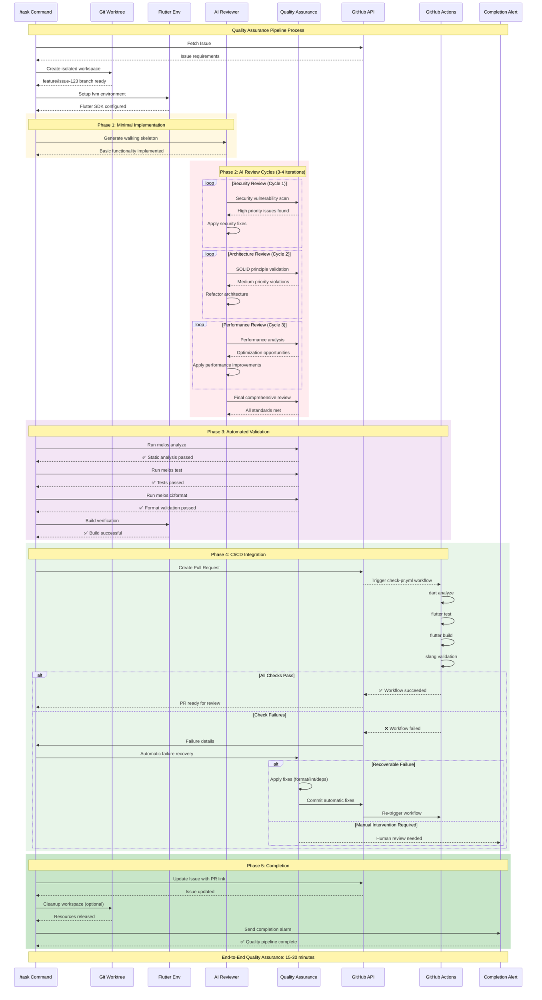

# GitHub Issue Processing Command - Claude 4 Best Practices

**IMPORTANT**: This command implements AI Review-First design following Claude 4 best practices for high-quality Flutter development using GitHub Issues.

## Overview

Process GitHub Issues using AI Review-First methodology. This command creates isolated work environments, applies structured review cycles, and ensures quality standards through automated validation.

## Core Principles (Claude 4 Best Practices)

**Reference**: `docs/CLAUDE_4_BEST_PRACTICES.md`

### AI Review-First Methodology

- **Pattern**: Small draft → Critical review → Regenerate → Release
- **Approach**: Use AI as "Senior Reviewer" not "Junior Designer"
- **Cycles**: 3-4 iterative review cycles for quality improvement
- **Priority**: Security (High) → SOLID Principles (Medium) → Performance (Low)

### Clear Instructions

- Eliminate ambiguity in task definitions
- Define specific deliverables and quality criteria
- Provide structured review templates with evaluation categories

### Structured Quality Assessment

Apply consistent evaluation framework:

```
1. Security vulnerabilities (HIGH PRIORITY)
2. SOLID principle violations (MEDIUM PRIORITY)
3. Performance optimization (LOW PRIORITY)
Constraint: Summarize findings within 400 characters
```

## Execution Modes

### Interactive Mode (No Arguments)

```bash
/task
```

**Behavior**:

1. Fetch Issues from GitHub using `gh issue list`
2. Display interactive Issue selection list (title, labels, assignee)
3. Support multiple Issue selection
4. Confirm selections before parallel execution

### Automatic Mode (With Arguments)

```bash
/task #123 #456
```

**Behavior**:

- **No confirmation prompts** - immediate execution
- Validate Issue numbers via GitHub CLI
- Create isolated work environments automatically
- Begin background processing with completion notifications

## AI Review-First Processing Flow

### Phase 1: Minimal Implementation

**Objective**: Create walking skeleton for review

**Actions**:

- Configure Flutter version using fvm
- Create dedicated branch via git worktree
- Implement ONLY core functionality per Issue requirements
- Create basic test cases

**Quality Gate**: Compilable code with basic functionality

### Phase 2: Critical Review Cycles (3-4 Iterations)

**Review Template** (Use this exact format):

```
Please review the following code implementation.

Evaluation Categories:
1. Security vulnerabilities (high priority)
2. SOLID principle violations (medium priority)
3. Performance optimization opportunities (low priority)

Constraint: Provide specific, actionable feedback within 400 characters.
Focus on the highest priority issues first.
```

**Iterative Improvement Process**:

1. **Cycle 1**: Address ALL high priority security issues
2. **Cycle 2**: Fix major SOLID principle violations
3. **Cycle 3**: Optimize performance within feasible scope
4. **Final Validation**: Human review of AI recommendations

**Quality Gates**:

- Security: Zero high-severity vulnerabilities
- Architecture: Major design principle violations resolved
- Performance: Identified bottlenecks addressed

### Phase 3: Release Preparation

**Actions**:

- Execute code quality checks: `dart analyze`, `dart format`
- Run automated and manual test suites
- Create Pull Request with appropriate template
- Monitor GitHub Actions: `.github/workflows/check-pr.yml`
- Update GitHub Issue with progress comments
- Send completion notification with alarm

**Quality Gate**: All CI/CD checks pass, human validation complete

## GitHub CLI Integration

### Issue Management Commands

```bash
# List open issues assigned to current user
gh issue list --assignee @me --state open

# Get issue details
gh issue view #123

# Add comment to issue
gh issue comment #123 --body "Progress update"

# Close issue with PR reference
gh issue close #123 --comment "Fixed in PR #456"
```

### PR Creation with Templates

```bash
# Create PR using feature template
gh pr create --template .github/pull_request_template/feature.md \
  --title "feat: Issue title [#123]" \
  --body "$(cat pr_body.md)"

# Create PR using bugfix template
gh pr create --template .github/pull_request_template/bugfix.md \
  --title "fix: Bug description [#123]" \
  --body "$(cat pr_body.md)"
```

## Completion Criteria

Task completion requires ALL conditions met:

### 1. AI Review-First Standards

- ✅ **3-4 review cycles completed successfully**
- ✅ **Security**: All high priority vulnerabilities resolved
- ✅ **SOLID Principles**: Major architectural issues fixed
- ✅ **Performance**: Optimization opportunities addressed within scope

### 2. Implementation Quality Standards

- ✅ **Feature Complete**: All Issue requirements implemented
- ✅ **Test Coverage**: Automated and manual tests passing
- ✅ **Code Quality**: Static analysis and formatting checks pass
- ✅ **Human Validation**: Final review confirms AI recommendations

### 3. Release Readiness

- ✅ **Documentation**: Pull Request with appropriate template
- ✅ **CI/CD Pipeline**: All GitHub Actions checks successful
- ✅ **Issue Management**: GitHub Issue updated with PR reference

### 4. Failure Recovery

- ✅ **Automatic Correction**: Attempt fixes for common CI failures
- ✅ **Quality Assurance**: Re-validate after corrections

## GitHub Actions Integration

### Quality Assurance Pipeline

**Comprehensive Quality Framework**: Multi-stage validation ensuring production-ready code through automated and manual quality gates.



#### Stage 1: Code Quality Analysis

**Flutter-Specific Checks**:

```bash
# Static analysis with Flutter rules
melos run analyze
dart analyze --fatal-infos --fatal-warnings

# Format validation
melos run ci:format
dart format --set-exit-if-changed .

# Translation validation
melos run analyze:slang
```

**Quality Metrics**:

- Zero analyzer warnings/errors
- 100% code formatting compliance
- All translation keys validated

#### Stage 2: Security Assessment

**Automated Security Scan**:

```bash
# Dependency vulnerability check
flutter pub deps --json | jq '.packages[] | select(.kind == "direct")'

# Sensitive data detection
grep -r "API_KEY\|SECRET\|PASSWORD" --exclude-dir=.git .
```

**Security Checklist**:

- ✅ No hardcoded secrets or API keys
- ✅ Proper input validation and sanitization
- ✅ Secure data storage practices
- ✅ Network security implementation

#### Stage 3: AI Review Cycles (3-4 Iterations)

**Structured Review Process**:

```
Review Template (400 character limit):
1. Security vulnerabilities (HIGH)
2. SOLID principle violations (MEDIUM)
3. Performance optimization (LOW)

Focus: Actionable feedback only
```

**Iterative Improvement**:

- **Cycle 1**: Critical security issues
- **Cycle 2**: Architectural violations
- **Cycle 3**: Performance optimizations
- **Cycle 4**: Final validation

#### Stage 4: Test Execution

**Comprehensive Testing**:

```bash
# Unit tests
melos run test

# Widget tests (specific files)
cd app && fvm flutter test test/widget_test.dart

# Integration tests (if available)
cd app && fvm flutter test integration_test/
```

**Coverage Requirements**:

- Unit tests for all business logic
- Widget tests for UI components
- Integration tests for critical flows

#### Stage 5: Build Verification

**Multi-platform Build Tests**:

```bash
# Android build
cd app && fvm flutter build apk --debug

# iOS build (macOS only)
cd app && fvm flutter build ios --no-codesign --debug

# Web build
cd app && fvm flutter build web --debug
```

#### Stage 6: CI/CD Pipeline Integration

**GitHub Actions Workflow**: `.github/workflows/check-pr.yml`

**Monitored Checks**:

- ✅ Static analysis (dart analyze)
- ✅ Code formatting (dart format)
- ✅ Test execution (flutter test)
- ✅ Build verification (flutter build)
- ✅ i18n validation (slang check)

**Pipeline Monitoring**:

```bash
# Check workflow status
gh run list --workflow=check-pr.yml --limit=1

# View detailed logs
gh run view --log

# Re-trigger on failure
gh workflow run check-pr.yml
```

#### Stage 7: Automatic Failure Recovery

**Intelligent Error Resolution**:

```bash
# Failure Detection Pattern
case "$failure_type" in
    "format")
        echo "🔧 Applying automatic formatting..."
        melos run format
        git add -A && git commit -m "style: apply automatic formatting"
        ;;
    "lint")
        echo "🔧 Fixing lint issues..."
        dart fix --apply
        git add -A && git commit -m "fix: resolve lint issues"
        ;;
    "test")
        echo "🔧 Analyzing test failures..."
        # Run specific failing tests for diagnosis
        melos run test --reporter=json > test_results.json
        ;;
    "build")
        echo "🔧 Resolving build dependencies..."
        melos clean && melos run get && melos run gen
        ;;
esac
```

**Recovery Success Rate**: Target 85% automatic resolution of common failures

#### Stage 8: Quality Gate Validation

**Final Quality Checklist**:

```yaml
Quality Gates:
  Security:
    - No high/critical vulnerabilities: ✅
    - Input validation implemented: ✅
    - Secure storage practices: ✅

  Architecture:
    - SOLID principles followed: ✅
    - Design patterns appropriate: ✅
    - Code organization logical: ✅

  Performance:
    - No obvious bottlenecks: ✅
    - Efficient algorithms used: ✅
    - Resource usage optimized: ✅

  Testing:
    - Unit test coverage ≥80%: ✅
    - Widget tests for UI: ✅
    - Critical paths tested: ✅

  Documentation:
    - Code comments where needed: ✅
    - README updated if required: ✅
    - API documentation complete: ✅
```

**Completion Criteria**: ALL quality gates must pass before proceeding to release

**Human Escalation**: Quality gate failures after 2 automatic retry attempts require human intervention

### Automatic Failure Response

```bash
# Failure Detection and Recovery
❌ CI/CD Failure Detected
📋 Analyze failure type and root cause
🔧 Apply targeted corrections:
   - Test failures → Fix test implementation
   - Lint errors → Apply dart format
   - Build errors → Resolve dependencies
📤 Commit corrections and re-trigger pipeline
🔄 Monitor re-execution until success
✅ Confirm all checks pass before completion
```

## Parallel Execution with Quality Isolation

### Workspace Isolation Strategy

**Problem**: Prevent quality degradation when processing multiple Issues simultaneously

**Solution**: Project-internal isolated environments

```bash
project-root/
├── .claude-workspaces/          # Isolated work areas (gitignored)
│   ├── issue-123/               # Issue #123 workspace
│   │   ├── .claude-session      # Session isolation
│   │   └── [git worktree]       # feature/issue-123 branch
│   └── issue-456/               # Issue #456 workspace
│       ├── .claude-session      # Independent session
│       └── [git worktree]       # feature/issue-456 branch
```

### Quality Management for Parallel Execution

```bash
# Multiple Issue processing with unified quality standards
/task #123 #456

# Execution flow:
# 📁 #123: Independent AI Review-First cycle in .claude-workspaces/issue-123/
# 📁 #456: Independent AI Review-First cycle in .claude-workspaces/issue-456/
# 🔄 Each workspace runs 3-4 review cycles independently
# ✅ Completion notification after ALL Issues meet quality standards
```

### Conflict Prevention

- **Duplicate Check**: Prevent concurrent processing of same Issue number
- **Resource Monitoring**: Queue execution when CPU/memory exceeds 80%
- **File Locking**: Use .lock files for exclusive workspace access
- **Git Isolation**: Exclude `.claude-workspaces/` from version control

### Workspace Management

```bash
# Monitor active workspaces
/task-running

# Cleanup completed workspaces
ls .claude-workspaces/
# issue-123/ (completed)  issue-456/ (in-progress)
```

## Execution Examples

### Interactive Selection

```bash
/task

📋 Available Issues:
1) #123: User authentication feature implementation (enhancement, @me)
2) #456: Bug fix: Login error handling (bug, @me)
3) #789: New feature: Push notifications (enhancement, @me)

? Select Issues to process [1-3, or multiple]: 1,3
? Execute with selected Issues: #123, #789? [Y/n]: y

🚀 Starting parallel execution with AI Review-First...
```

### Direct Execution

```bash
/task #123

✅ Issue validation: #123 confirmed in GitHub
✅ Workspace creation: .claude-workspaces/issue-123
✅ Git worktree: feature/issue-123
✅ Flutter environment: fvm setup complete
✅ AI Review-First: Quality standards configured
🚀 Background execution started...
📝 Implementing: User authentication feature
⏰ Completion alarm scheduled
```

## Error Handling and Recovery

### Input Validation Errors

```bash
/task #999999
❌ Error: Issue '#999999' not found in repository
💡 Use 'gh issue list' to view available Issues
```

### Review Cycle Failures

```bash
❌ Review cycle failed: Security vulnerabilities persist
🔧 Re-analyzing high priority issues
🔄 Continuing review cycle with additional focus
📋 Will escalate to human review if unresolvable
```

### Quality Standard Violations

```bash
❌ Quality standards not met: Multiple SOLID violations detected
📋 Detailed issue analysis:
    - Single Responsibility: 3 violations
    - Open/Closed Principle: 1 violation
🎯 Initiating additional review cycle
☝️ Human intervention required if standards remain unmet
```

## Best Practices and Limitations

### Optimal Use Cases

- **Well-defined Issue requirements** with clear acceptance criteria
- **Feature additions** to existing Flutter codebase
- **Bug fixes** with reproducible steps
- **Code quality improvements** and refactoring
- **Test case creation** and coverage improvement

### Limitations (When NOT to Use)

- **Large-scale system design** (1000+ lines) - requires human architecture
- **Domain-specific complex logic** - needs specialized knowledge
- **Cutting-edge technology** - outside AI training data
- **Performance-critical optimizations** - requires deep system knowledge

### Success Factors

1. **Clear Issue descriptions** with specific requirements
2. **Existing code patterns** for AI to follow
3. **Comprehensive test coverage** for validation
4. **Well-defined quality metrics** for objective assessment

## Project Dependencies and Configuration

### Required Technology Stack

- **Framework**: Flutter (Workspace/Monorepo structure)
- **Version Management**: fvm (Flutter Version Management)
- **Task Management**: GitHub Issues
- **Development Workflow**: git worktree for parallel development
- **State Management**: Riverpod (hooks_riverpod, riverpod_annotation)
- **Navigation**: go_router (declarative routing)
- **Internationalization**: slang (type-safe translations)
- **Build Tools**: build_runner, freezed
- **Monorepo Management**: Melos + pub workspace

### Environment Variables

```bash
export ENABLE_BACKGROUND_TASKS=true
export FLUTTER_VERSION_MANAGEMENT=fvm
export TASK_MANAGEMENT_SYSTEM=github
export PARALLEL_DEVELOPMENT=git_worktree
export PR_LANGUAGE=japanese
export COMPLETION_NOTIFICATION=alarm
export INTERACTIVE_MODE=true
export ISSUE_SELECTION_UI=enabled
export AUTO_CONFIRM_WITH_ARGS=true
export SILENT_MODE_WITH_ARGS=false
export ERROR_ONLY_OUTPUT=false
export CLAUDE_ISOLATION_MODE=true
export CLAUDE_WORKSPACE_DIR=".claude-workspaces"
export CLAUDE_MEMORY_ISOLATION=true
export GITHUB_ACTIONS_CHECK=true
export CHECK_PR_WORKFLOW="check-pr.yml"
```

### .gitignore Setup

```
.claude-workspaces/
*.lock
.claude-session
```

### Flutter Commands Integration

#### Melos Commands (Primary)

```bash
# Code generation (freezed, riverpod, go_router, slang)
melos run gen

# Install dependencies
melos run get

# Static analysis
melos run analyze

# slang translation check
melos run analyze:slang

# Code formatting
melos run format

# Run tests
melos run test

# CI format check
melos run ci:format
```

#### Direct Flutter Commands (Fallback)

```bash
# Run application
cd app && fvm flutter run

# Run tests (single file)
cd app && fvm flutter test test/widget_test.dart

# Build
cd app && fvm flutter build apk
cd app && fvm flutter build ios --no-codesign
```

### PR Creation Template Selection

The command automatically selects the appropriate PR template based on issue labels:

```bash
# For feature issues (labels: enhancement, feature)
.github/pull_request_template/feature.md

# For bug fixes (labels: bug, bugfix)
.github/pull_request_template/bugfix.md

# Default template if no specific label
.github/pull_request_template.md
```

### Troubleshooting Guide

#### GitHub CLI Authentication Error

```bash
# Re-authenticate GitHub CLI
gh auth login
```

#### fvm Version Conflict

```bash
# Reset Flutter version
fvm use [project_flutter_version]
flutter clean
flutter pub get
```

#### git worktree Creation Failure

```bash
# Check and delete existing worktrees
git worktree list
git worktree remove [worktree_path]
```

#### Background Tasks Not Working

```bash
# Check environment variables
echo $ENABLE_BACKGROUND_TASKS
export ENABLE_BACKGROUND_TASKS=true
```

### Performance Optimization Settings

- Parallel execution limit: Adjust according to CPU usage
- Memory usage monitoring: Control when creating large numbers of worktrees
- Resource monitoring: CPU/memory usage 80% threshold

### Security Considerations

- Safe management of GitHub tokens
- Proper configuration of git authentication credentials
- Careful handling of code containing sensitive information

---

**Note**: This command prioritizes code quality through AI Review-First methodology and requires git worktree support for parallel execution. Expect 3-4 review iterations per Issue to achieve production-ready standards.
