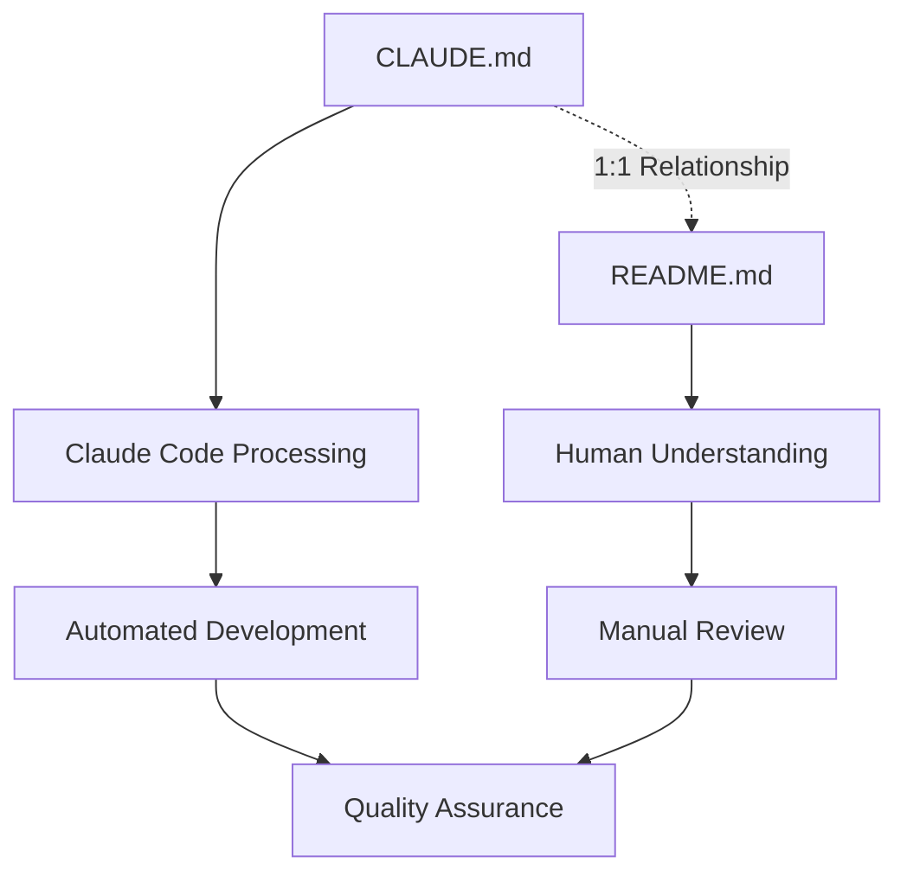

# CLAUDE.md

This file provides guidance to Claude Code (claude.ai/code) when working with code in this repository.

## Documentation Structure and Relationship

### CLAUDE.md - README.md Integration System

- **CLAUDE.md** (this file): Contains workflows and configurations for Claude Code to understand prompts and project structure
- **README.md**: Provides human-readable documentation that mirrors and explains the content in CLAUDE.md
- **1:1 Relationship**: CLAUDE.md and README.md maintain a one-to-one correspondence where each section in CLAUDE.md has an equivalent explanation in README.md. This constraint applies to the entire project structure - any CLAUDE.md file must have a corresponding README.md file in the same directory.

### Language Configuration

- **Default Language**: Japanese
- **README.md Language**: The README.md file uses the default language setting for all documentation
- **Translation Support**: Multi-language documentation can be provided through the i18n system

### Mermaid Visualization Workflow

The README.md file includes Mermaid diagrams to visualize:

- Project architecture overview
- Development workflow processes
- Component relationships
- System integration patterns



## Claude 4 Best Practices Application

This project follows the Claude 4 prompt engineering best practices defined in `docs/CLAUDE_4_BEST_PRACTICES.md`. We emphasize the following principles:

1. **AI Review-First Design**: "Small draft → Critical review → Regenerate → Release" cycle
2. **Clear and Specific Instructions**: Eliminate ambiguity and clearly define expected deliverables
3. **Structured Review Templates**: Evaluate code from security, SOLID principles, and performance perspectives
4. **Iterative Improvement**: Enhance quality through 3-4 review cycles

For details, refer to [Claude 4 Best Practices](docs/CLAUDE_4_BEST_PRACTICES.md).

## Project Overview

This is a Flutter mobile application development project using Claude Code with automated development workflow integrated with GitHub Issue management system.

### Technology Stack

- **Framework**: Flutter (Workspace/Monorepo structure)
- **Version Management**: mise (polyglot tool version manager)
- **Task Management**: GitHub Issues
- **Parallel Development**: git worktree
- **Automation**: Claude Code with background tasks
- **State Management**: Riverpod (hooks_riverpod, riverpod_annotation)
- **Navigation**: go_router (declarative routing)
- **Internationalization**: slang (type-safe translations)
- **Build Tools**: build_runner, freezed
- **Monorepo Management**: Melos + pub workspace

## Project Structure

<!-- AUTO-GENERATED SECTION: This section is automatically updated when project structure changes -->

```
flutter_template_project/
├── .claude-workspaces/         # Claude Code working directories (replaces worktrees/)
├── app/                        # Main Flutter application
│   ├── lib/
│   │   ├── main.dart          # Entry point
│   │   ├── pages/             # UI pages
│   │   │   ├── home/          # Home page components
│   │   │   └── settings/      # Settings page components
│   │   ├── router/            # go_router config and type-safe route definitions
│   │   └── i18n/              # slang-generated multilingual files
│   ├── assets/i18n/           # JSON translation files (ja.i18n.json, en.i18n.json)
│   ├── test/                  # Widget tests
│   ├── android/               # Android platform specific files
│   ├── ios/                   # iOS platform specific files
│   ├── web/                   # Web platform specific files
│   ├── linux/                 # Linux platform specific files
│   ├── macos/                 # macOS platform specific files
│   └── windows/               # Windows platform specific files
├── packages/                  # Shared packages (currently empty)
├── docs/                      # Project documentation
│   ├── CLAUDE_4_BEST_PRACTICES.md
│   ├── COMMITLINT_RULES.md
│   ├── COMMITLINT_YAML_CONFIGURATION.md
│   ├── MELOS_SETUP.md
│   ├── VSCODE_SETTINGS.md
│   └── WORKTREE_ARCHITECTURE.md
├── scripts/                   # Build and utility scripts
├── memos/                     # Development memos and notes
├── pubspec.yaml               # Workspace configuration
└── package.json               # Node.js dependencies (commitlint, prettier)
```

<!-- END AUTO-GENERATED SECTION -->

## Environment Setup

### Requirements

- Flutter SDK (managed by mise)
- bun (managed by mise)
- Git worktree support
- GitHub CLI (gh) installed and authenticated
- Claude Code ENABLE_BACKGROUND_TASKS enabled
- Bun (for commitlint, prettier, faster than Node.js)

## Development Commands

### Melos Commands (Recommended)

```bash
# Code generation (freezed, riverpod, go_router, slang)
melos run gen

# Install dependencies
melos run get

# Static analysis
melos run analyze

# slang translation check
melos run analyze:slang

# Code formatting
melos run format

# Run tests
melos run test

# CI format check
melos run ci:format
```

### Direct Flutter Commands (using mise)

```bash
# Activate mise environment first
eval "$(mise activate bash)"

# Run application
cd app && flutter run

# Run tests (single file)
cd app && flutter test test/widget_test.dart

# Build
cd app && flutter build apk
cd app && flutter build ios --no-codesign
```

### Bun Related Commands (Faster than Node.js)

```bash
# Install dependencies with bun (faster than npm)
bun install

# YAML/Markdown lint
bun run lint

# YAML/Markdown format
bun run format

# Clean and reinstall dependencies
bun run clean
```

### Development Workflow Commands

```bash
# Workflow 1: Code Quality Check
melos run analyze
melos run test
melos run format:prettier
melos run format

# Workflow 2: Development Environment Setup
mise install
eval "$(mise activate bash)"
melos run get
melos run gen

# Workflow 3: Release Preparation
melos run analyze
melos run test
melos run ci:format
melos run format:prettier
melos run format
```

### Environment Variables

```bash
export ENABLE_BACKGROUND_TASKS=true
export FLUTTER_VERSION_MANAGEMENT=mise
export TASK_MANAGEMENT_SYSTEM=github
export PARALLEL_DEVELOPMENT=git_worktree
export PR_LANGUAGE=japanese
export COMPLETION_NOTIFICATION=alarm
export INTERACTIVE_MODE=true
export ISSUE_SELECTION_UI=enabled
export AUTO_CONFIRM_WITH_ARGS=true      # Skip confirmation when arguments provided
export SILENT_MODE_WITH_ARGS=false      # Continue progress display
export ERROR_ONLY_OUTPUT=false          # Display non-error output
export CLAUDE_ISOLATION_MODE=true       # Work isolation during parallel execution
export CLAUDE_WORKSPACE_DIR=".claude-workspaces" # Project-internal working directory
export CLAUDE_MEMORY_ISOLATION=true     # Memory/context isolation
export GITHUB_ACTIONS_CHECK=true        # Enable GitHub Actions completion check
export CHECK_PR_WORKFLOW="check-pr.yml" # Target workflow file to monitor
```

## Architecture Design

### State Management: Riverpod

- **Providers**: Located in `app_preferences/lib/src/providers/`
- **Code Generation**: Use `@riverpod` annotation, generate with `melos run gen`
- **AsyncValue**: Used for asynchronous operation state management
- **Provider Types**:
  - `StateNotifierProvider`: Logic with state changes
  - `FutureProvider`: Asynchronous data retrieval
  - `StreamProvider`: Real-time data streams

### Navigation: go_router

- **Route Definition**: `app/lib/router/app_routes.dart`
- **Type-safe Routing**: Achieve type safety with `@TypedGoRoute` annotation
- **Navigation Example**: `HomePageRoute().go(context)`

### Internationalization: slang

- **Translation Files**: Place `ja.i18n.json` and `en.i18n.json` in `app/assets/i18n/`
- **Type-safe Access**: Access translation strings with `context.i18n.someKey`
- **Dynamic Switching**: Runtime language switching using LocaleSettings

### Theme Management

- **Theme Provider**: Managed by `app_preferences` package
- **Persistence**: Save selected theme using SharedPreferences
- **System Theme**: Material You (Android 12+) support

## Custom Slash Commands Configuration

### Available Commands

- `/task` - GitHub Issue processing command (see `.claude/commands/task.md` for detailed implementation)

### Command File Placement

```
.claude/
└── commands/
    └── task.md            # Complete GitHub Issue processing implementation
```

## Development Workflow

### Git Worktree Usage (Recommended)

This project uses **git worktree** for parallel development:

1. **Parallel Development**: Multiple Issues can be worked on simultaneously
2. **Branch Isolation**: Each Issue gets its own working directory via git worktree
3. **Environment Independence**: Separate Flutter environments per worktree
4. **Conflict Prevention**: Isolated workspaces prevent interference between tasks

**Basic git worktree commands**:

```bash
# Create new worktree
git worktree add path/to/worktree -b branch-name

# List active worktrees
git worktree list

# Remove completed worktree
git worktree remove path/to/worktree
```

**Note**: The `/task` command handles git worktree creation automatically for GitHub Issue processing.

For detailed GitHub Issue processing workflow, execution examples, and configuration options, refer to `.claude/commands/task.md`.

---

**Note**: This file is an important configuration file that controls Claude Code behavior. Test thoroughly when making changes.

## Development Guidelines

### Code Generation

- Always execute `melos run gen` after adding new model classes or providers
- Do not directly edit generated files (`*.g.dart`, `*.freezed.dart`)

### Testing

- Add corresponding widget tests to `app/test/` when adding new features
- Execute `melos run test` to run tests for all packages
- Include tests as targets for AI Review-First

### Git Workflow

- Use [Conventional Commits](https://www.conventionalcommits.org/) format for commit messages
- **Branch naming**: Use only `feature/ISSUE_ID` format (no Japanese/English descriptions)
- PR checks automatically execute with `.github/workflows/check-pr.yml`
- Includes analysis, formatting, testing, i18n validation

### Package Management

- Add new dependencies to the appropriate package's `pubspec.yaml`
- Same versions used across all packages due to Workspace resolution
- Update all package dependencies collectively with `melos run get`

## Automated Development Workflows

### Workflow 1: Code Quality Assurance

**Purpose**: Ensure consistent code quality across all development activities

**Steps**:

1. Static analysis with `melos run analyze`
2. Code formatting validation with `melos run ci:format`
3. Automated testing with `melos run test`
4. Translation validation with `melos run analyze:slang`
5. Final formatting with `melos run format:prettier`
6. Final formatting with `melos run format`

### Workflow 2: Documentation Synchronization

**Purpose**: Maintain consistency between CLAUDE.md and related documentation

**Steps**:

1. Monitor file changes in project structure
2. Auto-update "## Project Structure" section when files are added/removed
3. Validate documentation compliance with Claude 4 Best Practices
4. Synchronize corresponding README.md when CLAUDE.md is updated (1:1 relationship enforcement)
5. Final formatting with `melos run format:prettier`
6. Final formatting with `melos run format`

### Workflow 3: Development Environment Validation

**Purpose**: Ensure proper development environment setup and configuration

**Steps**:

1. Validate Flutter version with fvm
2. Check GitHub CLI configuration
3. Verify git worktree support
4. Validate environment variables
5. Test Claude Code integration
6. Final formatting with `melos run format:prettier`
7. Final formatting with `melos run format`
