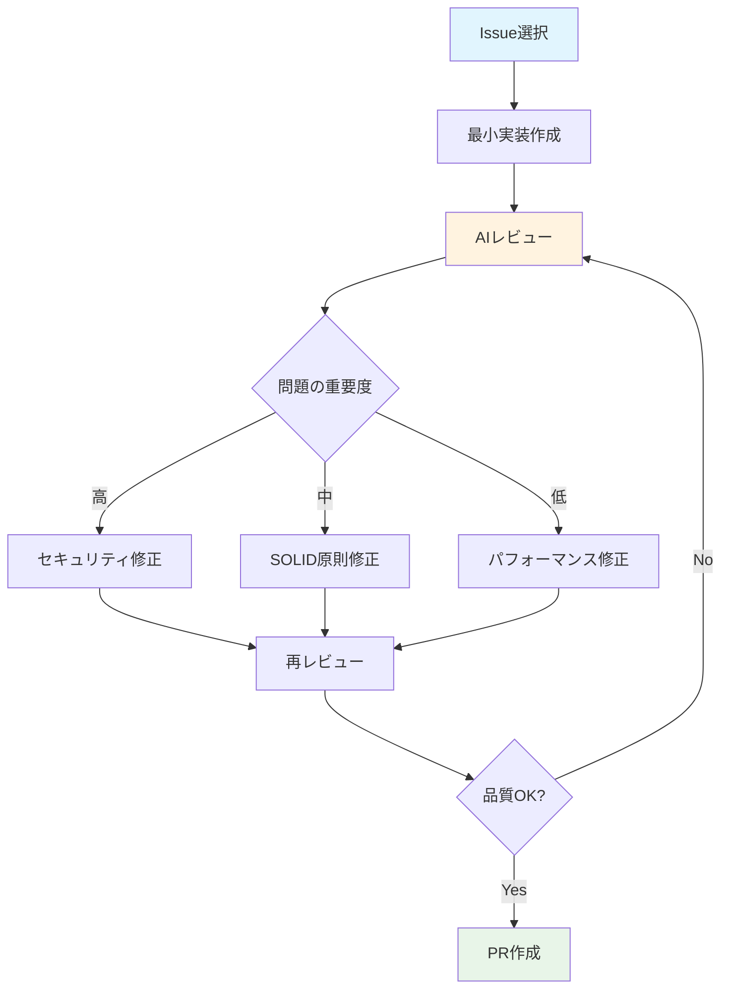

# Claude Code 使用ガイド

**Linear Issueを指定するだけで、自動的にコード実装からPR作成まで完全自動化**

## 🎯 主な機能

- **Issue指定だけで自動実装**: Linear Issueを指定するだけで自動コード生成
- **AI Review-First設計**: 高品質コードを3-4回のレビューサイクルで生成
- **並列処理**: 複数Issueを同時に処理して効率化
- **完全自動化**: PR作成・GitHub Actions監視まで自動

## 📚 目次

- [セットアップ](#セットアップ)
- [基本的な使い方](#基本的な使い方)
- [ワークフロー図解](#ワークフロー図解)
- [実際の開発例](#実際の開発例)
- [よくある質問](#よくある質問)
- [トラブルシューティング](#トラブルシューティング)

## ⚡ クイックスタート

### 必要な環境設定

```bash
# 必須: これだけあれば動作します
export ENABLE_BACKGROUND_TASKS=true
export TASK_MANAGEMENT_SYSTEM=linear
export FLUTTER_VERSION_MANAGEMENT=fvm
```

### 使い方（3ステップ）


## 基本コマンド

| コマンド | 説明 | 使用例 |
|---------|-----|--------|
| `/linear ABC-123` | Issue自動処理 | `/linear AUTH-001` |
| `/linear` | 対話式Issue選択 | Issue選択画面が表示 |
| `/linear-list` | Issue一覧表示 | 利用可能なIssue確認 |
| `/linear-status` | 接続状況確認 | Linear連携チェック |

### 実行例

```bash
# 1. Claude Code起動
claude

# 2. Issue処理（どちらでもOK）
/linear AUTH-001        # 直接指定
/linear                 # 対話式選択

# 3. 完了まで待機（アラーム音で通知）
```

## 🔄 AI Review-Firstワークフロー

Claude 4のベストプラクティスに基づく「小さなドラフト → 厳しい批評 → 再生成 → リリース」サイクル：



複数のIssueを同時に処理することで、開発効率を大幅に向上させます：


```bash
# 複数Issue同時処理
/linear AUTH-001 UI-002 BUG-003

# または別ターミナルで並列実行
# ターミナル1: /linear AUTH-001
# ターミナル2: /linear UI-002
```

## 💡 使用例

### 新機能実装
```bash
claude
/linear AUTH-001  # ユーザー認証機能の実装
# → 自動で実装・テスト・PR作成
```

### 緊急バグ修正
```bash
claude
/linear URGENT-999  # 重要なバグを即座に修正
# → 最優先で処理開始
```

### 複数作業
```bash
claude
/linear AUTH-001 UI-002 BUG-003  # 3つ同時処理
# → 並列実行で効率化
```

## よくある質問

**Q: 複数Issue同時処理**
```bash
/linear ABC-123 XYZ-456 DEF-789  # 複数指定
# または別ターミナルで並列実行
```

**Q: 作業状況確認**
```bash
/linear-running  # 実行中タスク確認
```

**Q: 失敗時の対応**
- GitHub Actions失敗時は自動修正を試行
- 修正不可の場合はPRにエラー報告
- 必要に応じて手動修正

## トラブルシューティング

### 🔧 よくある問題と解決方法

#### 問題1: Linear API接続エラー

```bash
# 症状: "Linear API connection failed"
# 解決方法:
/linear-status  # 接続状況確認
```

**原因と対策:**
- MCP設定が正しくない → Linear MCP設定を再確認
- APIキーの期限切れ → 新しいAPIキーに更新

#### 問題2: Flutter環境エラー

```bash
# 症状: "Flutter command not found"
# 解決方法:
fvm use stable  # Flutterバージョン設定
flutter doctor  # 環境確認
```

#### 問題3: git worktree作成失敗

```bash
# 症状: "worktree already exists"
# 解決方法:
git worktree list              # 既存確認
git worktree remove ISSUE-123  # 削除
```

#### 問題4: バックグラウンドタスクが動かない

```bash
# 症状: 実行が開始されない
# 解決方法:
echo $ENABLE_BACKGROUND_TASKS  # 環境変数確認
export ENABLE_BACKGROUND_TASKS=true
```

### 🚨 緊急時対応

```bash
# 強制停止
ps aux | grep claude && kill [PID]
rm -rf .claude-workspaces/ISSUE-ID

# 手動完了
cd .claude-workspaces/ISSUE-ID
git add . && git commit -m "fix: manual completion"
git push origin feature/ISSUE-ID
```

## 📈 効率化のコツ

### Issue設計
- 大きな機能は複数の小さなIssueに分割
- 1つのIssueは1つの関心事に集中
- 依存関係のないIssueは並列処理

### 品質管理
- AIが作成したコードも必ず人間がレビュー
- 自動テストの結果を必ず確認
- 新機能は必ずドキュメントも更新

## 成功の秘訣

1. **Issue設計**が成功の鍵 - 小さく分割
2. **並列処理**で作業効率大幅アップ
3. **AIレビュー**で品質も安心 - 3-4回のサイクル
4. **完全自動化**でPRまで作成

困ったときは`/linear-status`で状況確認してください。