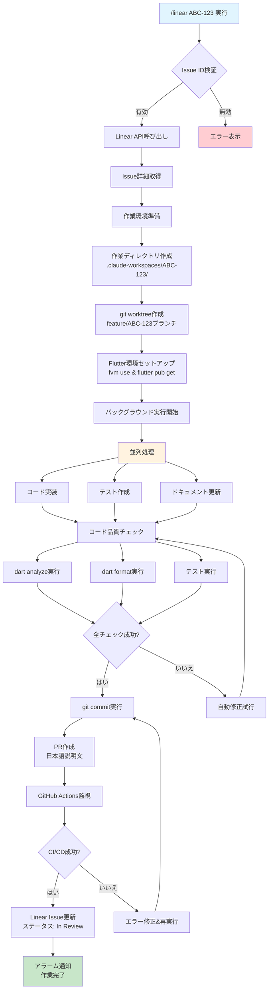

# HUMAN.md - CLAUDE.md解説ドキュメント

## このドキュメントについて

このドキュメント（HUMAN.md）は、Claude Code用の設定ファイルである「CLAUDE.md」を人間が理解しやすいように日本語で解説したものです。CLAUDE.mdはClaude Codeが動作を制御するために読み込む特殊なファイルですが、その内容を開発者が理解し、活用できるように説明します。

## CLAUDE.mdとは？

CLAUDE.mdは、Claude Codeがプロジェクトで作業する際の「ルールブック」です。このファイルに記載された指示に従って、Claude Codeは自動的にタスクを実行します。

### 主な機能

1. **プロジェクト固有の設定**: Flutter開発環境の詳細設定
2. **自動化ワークフロー**: Linear（タスク管理ツール）と連携した開発フロー
3. **並列作業**: 複数のタスクを同時に処理できる環境設定
4. **品質管理**: テスト実行やコード品質チェックの自動化

## 実際の使い方

### 基本的な使用例

このプロジェクトで最も頻繁に使用するのは「/linear」コマンドです。

#### 直接実行（Issue IDを指定）

```bash
# Claude Codeを起動
claude

# Issue IDを直接指定
/linear ABC-123
```

この場合、確認なしで即座に作業が開始されます。Claude Codeが自動的に：

- 新しいブランチを作成
- 必要なコードを実装
- テストを作成・実行
- PRを作成（日本語で説明文を記載）
- 完了をアラームで通知

### `/linear <ISSUE_ID>`の内部処理フロー

以下は`/linear ABC-123`を実行した際の裏側の処理を示したフロー図です：



#### 処理の詳細説明

1. **初期検証フェーズ**

   - Issue ID形式の検証（ABC-123形式）
   - Linear APIでIssueの存在確認
   - アクセス権限の確認

2. **環境準備フェーズ**

   - プロジェクト内に独立した作業ディレクトリを作成
   - git worktreeで新しいブランチを作成
   - Flutter/Dartの依存関係をインストール

3. **実装フェーズ（並列実行）**

   - Issue内容を解析してコード実装
   - 対応するテストコード作成
   - 必要に応じてドキュメント更新

4. **品質保証フェーズ**

   - 静的解析（dart analyze）
   - コードフォーマット（dart format）
   - 自動テスト実行

5. **完了処理フェーズ**
   - 変更をコミット
   - 日本語でPR作成
   - GitHub Actionsの結果を監視
   - Linear IssueをIn Reviewに更新
   - アラームで完了通知

### 並列作業の仕組み

CLAUDE.mdの設定により、複数のタスクを同時に処理できます：

```bash
# ターミナル1で
claude
/linear ABC-123  # ユーザー認証機能の実装

# ターミナル2で（別のターミナルウィンドウ）
claude
/linear XYZ-456  # バグ修正作業
```

それぞれのタスクは独立した環境で実行されるため、お互いに干渉しません。

### 作業の流れ

1. **タスク選択**: Linear上のIssueを選択
2. **環境準備**: 自動的に作業用ディレクトリとブランチを作成
3. **実装**: Issue内容に基づいてコードを実装
4. **品質チェック**: テスト実行、コード品質チェック
5. **PR作成**: 日本語で説明文を記載したPRを作成
6. **完了通知**: アラームで作業完了を通知

## 環境変数の意味

CLAUDE.mdに記載されている環境変数の詳細説明：

| 環境変数名                   | 設定値                 | 説明                                       | 重要度  |
| ---------------------------- | ---------------------- | ------------------------------------------ | ------- |
| `ENABLE_BACKGROUND_TASKS`    | `true`                 | バックグラウンドでタスクを実行（必須）     | 🔴 必須 |
| `FLUTTER_VERSION_MANAGEMENT` | `fvm`                  | Flutterバージョン管理ツールを指定          | 🟡 推奨 |
| `TASK_MANAGEMENT_SYSTEM`     | `linear`               | タスク管理システムにLinearを使用           | 🔴 必須 |
| `PARALLEL_DEVELOPMENT`       | `git_worktree`         | 並列開発にgit worktreeを使用               | 🟡 推奨 |
| `PR_LANGUAGE`                | `japanese`             | PRの説明文を日本語で作成                   | 🟢 任意 |
| `COMPLETION_NOTIFICATION`    | `alarm`                | 作業完了時にアラームで通知                 | 🟢 任意 |
| `INTERACTIVE_MODE`           | `true`                 | 対話形式でIssueを選択可能                  | 🟡 推奨 |
| `ISSUE_SELECTION_UI`         | `enabled`              | Issue選択UIを有効化                        | 🟢 任意 |
| `AUTO_CONFIRM_WITH_ARGS`     | `true`                 | 引数ありの場合は確認をスキップ             | 🟡 推奨 |
| `SILENT_MODE_WITH_ARGS`      | `false`                | 進捗表示は継続（無音モードではない）       | 🟢 任意 |
| `ERROR_ONLY_OUTPUT`          | `false`                | エラー以外も表示（エラーのみ表示ではない） | 🟢 任意 |
| `CLAUDE_ISOLATION_MODE`      | `true`                 | 並列実行時の作業分離を有効化               | 🔴 必須 |
| `CLAUDE_WORKSPACE_DIR`       | `".claude-workspaces"` | プロジェクト内作業ディレクトリの場所       | 🟡 推奨 |
| `CLAUDE_MEMORY_ISOLATION`    | `true`                 | メモリ・コンテキスト分離を有効化           | 🔴 必須 |
| `GITHUB_ACTIONS_CHECK`       | `true`                 | GitHub Actions完了チェックを有効化         | 🟡 推奨 |
| `CHECK_PR_WORKFLOW`          | `"check-pr.yml"`       | 監視対象のワークフローファイル名           | 🟡 推奨 |

### 設定の重要度について

- 🔴 **必須**: この設定がないと正常に動作しません
- 🟡 **推奨**: 設定することで機能が向上します
- 🟢 **任意**: お好みに応じて設定してください

### 設定例

```bash
# 必須設定（最低限これらは設定が必要）
export ENABLE_BACKGROUND_TASKS=true
export TASK_MANAGEMENT_SYSTEM=linear
export CLAUDE_ISOLATION_MODE=true
export CLAUDE_MEMORY_ISOLATION=true

# 推奨設定（より良い体験のために）
export FLUTTER_VERSION_MANAGEMENT=fvm
export PARALLEL_DEVELOPMENT=git_worktree
export INTERACTIVE_MODE=true
export AUTO_CONFIRM_WITH_ARGS=true
export CLAUDE_WORKSPACE_DIR=".claude-workspaces"
export GITHUB_ACTIONS_CHECK=true
export CHECK_PR_WORKFLOW="check-pr.yml"

# 任意設定（プロジェクトの要件に応じて）
export PR_LANGUAGE=japanese
export COMPLETION_NOTIFICATION=alarm
export ISSUE_SELECTION_UI=enabled
```

## トラブルシューティング

### よくある問題

#### Linear連携ができない

```bash
# 連携状況を確認
/linear-status
```

#### Flutter環境の問題

```bash
# Flutterバージョンを再設定
fvm use stable  # または特定のバージョン
flutter clean
flutter pub get
```

#### 並列実行時の問題

作業ディレクトリが残っている場合：

```bash
# 既存のworktreeを確認
git worktree list

# 不要なworktreeを削除
git worktree remove .claude-workspaces/ABC-123
```

## 高度な使い方

### 複数Issueの同時処理

```bash
# 複数のIssue IDを指定
/linear ABC-123 XYZ-456 FEAT-789
```

### Issue一覧の確認

```bash
# 利用可能なIssueを表示
/linear-list
```

### 実行中のタスク確認

```bash
# 現在実行中のタスクを表示
/linear-running
```

## 注意事項

1. **自動コミット**: `/linear`コマンドは自動的にコミットしますが、pushはしません
2. **PR作成**: PRは自動作成されますが、マージは手動で行う必要があります
3. **テスト実行**: テストが失敗した場合、Claude Codeが自動的に修正を試みます
4. **リソース使用**: 複数タスクを並列実行する際は、マシンのリソースに注意してください

## まとめ

CLAUDE.mdは、このFlutterプロジェクトでClaude Codeを最大限活用するための設定ファイルです。主な利点：

- **効率化**: Linear Issueから自動的にコードを実装
- **品質保証**: テストとコード品質チェックの自動化
- **並列開発**: 複数のタスクを同時に処理可能
- **日本語対応**: PRの説明文を日本語で作成

開発者は`/linear`コマンドを使うだけで、これらの機能を活用できます。
