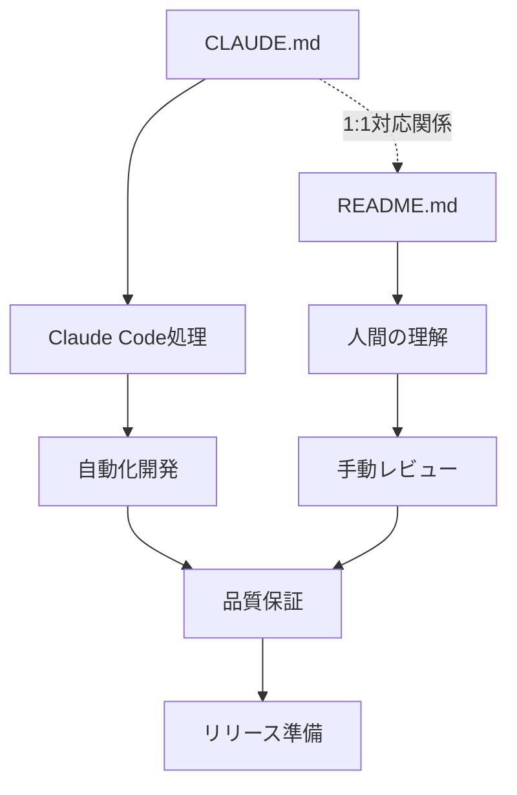
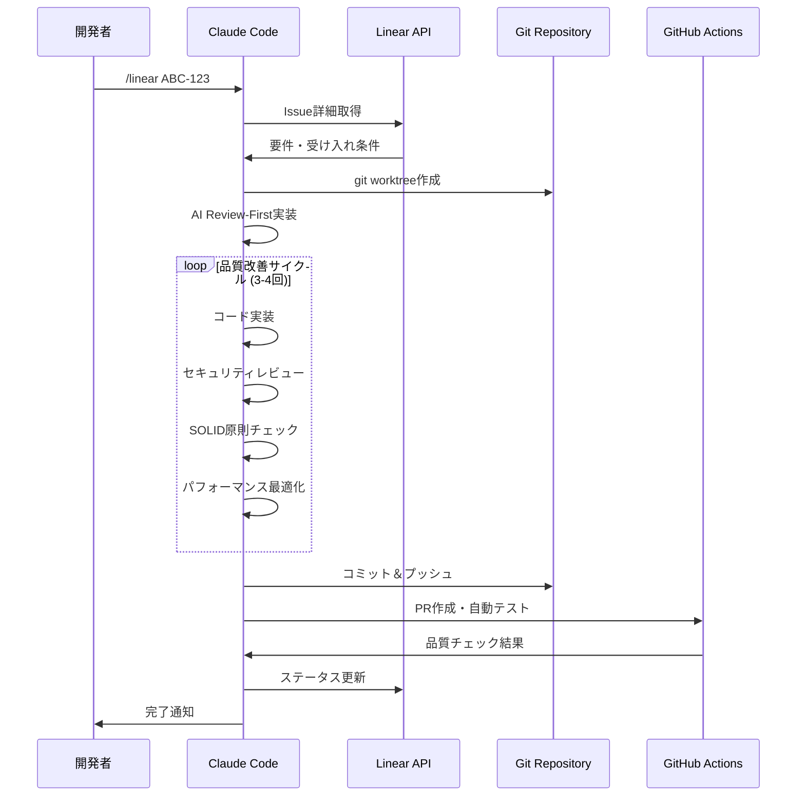
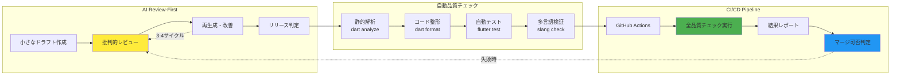
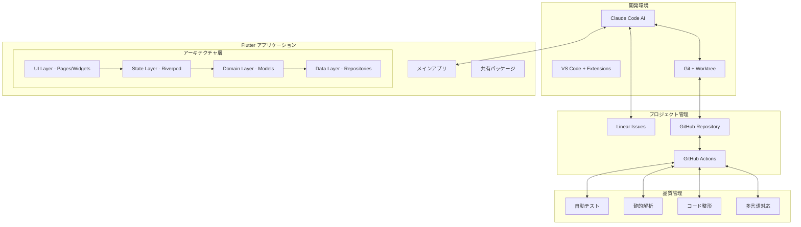

# Flutter Template Project

**AI支援開発とモダンアーキテクチャを組み合わせた、エンタープライズ対応Flutterアプリケーションテンプレート**

## プロジェクト概要

このテンプレートは、効率的なFlutterアプリ開発を実現するための包括的な環境を提供します。Claude CodeによるAI支援開発、モノレポ構造、自動化された品質管理により、開発チームの生産性を大幅に向上させます。

### ドキュメント構造とAI統合システム

このプロジェクトは、AI支援開発と人間による開発の両方を最適化するための統合ドキュメントシステムを採用しています：



#### ドキュメント分担

| ファイル      | 対象者           | 内容                         | 言語   |
| ------------- | ---------------- | ---------------------------- | ------ |
| **CLAUDE.md** | Claude Code (AI) | ワークフロー、設定、技術指示 | 英語   |
| **README.md** | 開発者 (人間)    | プロジェクト概要、使用方法   | 日本語 |

#### 1:1対応原則

- CLAUDE.mdの各セクションは、README.mdの対応セクションで人間向けに説明
- 技術的な詳細は両方のファイルで一貫性を保持
- 変更時は両ファイルを同期更新

### 核となる特徴

- **🤖 AI支援開発**: Claude Code統合によるLinear Issue駆動の自動開発
- **📦 モノレポ構造**: Melosによる効率的なマルチパッケージ管理
- **🎯 型安全性**: Riverpod、go_router、slangによる堅牢なアーキテクチャ
- **⚡ 開発効率**: 自動コード生成とHot Reloadによる高速開発サイクル
- **🔍 品質保証**: 自動テスト、linting、フォーマットによる一貫したコード品質

## 技術スタック

| 分野               | 技術                 | 役割                             |
| ------------------ | -------------------- | -------------------------------- |
| **フレームワーク** | Flutter + FVM        | マルチプラットフォーム開発       |
| **状態管理**       | Riverpod + Hooks     | リアクティブな状態アーキテクチャ |
| **ナビゲーション** | go_router            | 型安全なルーティング             |
| **国際化**         | slang                | コード生成による多言語対応       |
| **モノレポ**       | Melos                | パッケージ統合管理               |
| **AI開発**         | Claude Code + Linear | 自動化された開発ワークフロー     |

## プロジェクト構成

```
flutter_template_project/
├── 📱 app/                      # メインアプリケーション
│   ├── lib/                     # アプリケーションコード
│   └── assets/i18n/             # 多言語対応ファイル
├── 📦 packages/                 # 共有パッケージ
│   └── app_preferences/         # 設定管理パッケージ
├── 🤖 .claude/                  # AI開発支援設定
├── 📋 CLAUDE.md                 # AI用プロジェクト設定
├── 📋 HUMAN.md                  # 開発者向け設定解説
├── 🔧 scripts/                 # 自動化スクリプト
└── 📚 docs/                    # プロジェクトドキュメント
```

## クイックスタート

### 必要な環境

| ツール  | 推奨バージョン | インストール方法                  |
| ------- | -------------- | --------------------------------- |
| Flutter | FVM管理        | `dart pub global activate fvm`    |
| Node.js | 18+            | [nodejs.org](https://nodejs.org/) |
| Melos   | 7.0+           | `dart pub global activate melos`  |

### セットアップ手順

```bash
# 1. プロジェクトを取得
git clone <repository-url>
cd flutter_template_project

# 2. 開発環境を構築
fvm install && fvm use
npm install
melos bootstrap

# 3. コード生成を実行
melos run gen

# 4. アプリを起動
cd app && fvm flutter run
```

## 開発ワークフロー

### 基本的な開発手順

```bash
# 開発用コマンド
melos run get      # 依存関係の更新
melos run gen      # コード生成（riverpod、freezed等）
melos run analyze  # 静的解析
melos run test     # テスト実行
melos run format   # コード整形
```

### AI支援開発（Claude Code）

Claude CodeとLinearを連携した自動開発機能を提供：

```bash
# Claude Code起動
claude

# Issue指定で自動開発開始
/linear ABC-123
```

#### AI支援開発プロセス



**特徴:**

- Linear Issueの内容を解析し、自動実装
- AI品質レビューによる反復改善（3-4サイクル）
- 自動テスト実行とPR作成
- 並行開発のためのgit worktree活用
- セキュリティ・SOLID原則・パフォーマンスの体系的チェック

## 重要なファイル

| ファイル      | 目的                          | 読者       |
| ------------- | ----------------------------- | ---------- |
| **CLAUDE.md** | Claude Code用設定（AI指示書） | AIシステム |
| **HUMAN.md**  | 開発者向けCLAUDE.md解説書     | 開発チーム |

これらのファイルは、AI支援開発の動作を制御する重要な設定です。

## 品質管理

### 品質管理パイプライン



### コード品質ツール

- **commitlint**: [Conventional Commits](https://conventionalcommits.org/)準拠
- **prettier**: YAML/Markdown自動フォーマット
- **dart analyze**: Flutter静的解析
- **自動テスト**: ユニット・ウィジェット・統合テスト
- **AI Review-First**: セキュリティ・SOLID原則・パフォーマンスの体系的評価

### コミット規約

```bash
feat: 新機能追加
fix: バグ修正
docs: ドキュメント更新
style: コードスタイル変更
refactor: リファクタリング
test: テスト関連
chore: その他のメンテナンス
```

## アーキテクチャ概要

### システム全体構成



### 状態管理パターン

**Riverpod + Hooks** による宣言的UI：

```dart
@riverpod
class CounterNotifier extends _$CounterNotifier {
  @override
  int build() => 0;

  void increment() => state++;
}

// UI での使用
class CounterPage extends ConsumerWidget {
  Widget build(context, ref) {
    final count = ref.watch(counterNotifierProvider);
    return Text('Count: $count');
  }
}
```

### 国際化アプローチ

**slang** による型安全な多言語対応：

```dart
// assets/i18n/ja.i18n.json
{
  "welcome": "ようこそ",
  "settings": {
    "title": "設定"
  }
}

// UI での使用
Text(context.i18n.welcome)
Text(context.i18n.settings.title)
```

## テスト戦略

| テストレベル | 対象              | ツール           |
| ------------ | ----------------- | ---------------- |
| ユニット     | ビジネスロジック  | flutter_test     |
| ウィジェット | UI コンポーネント | flutter_test     |
| 統合         | ユーザーフロー    | integration_test |

```bash
# 全テスト実行
melos run test

# カバレッジ付き実行
melos run test --coverage
```

## ドキュメント

| ドキュメント                                         | 内容         | 対象者      |
| ---------------------------------------------------- | ------------ | ----------- |
| [CLAUDE.md](CLAUDE.md)                               | AI開発設定   | Claude Code |
| [HUMAN.md](HUMAN.md)                                 | 設定解説書   | 開発者      |
| [docs/VSCODE_SETTINGS.md](docs/VSCODE_SETTINGS.md)   | エディタ設定 | 開発者      |
| [docs/COMMITLINT_RULES.md](docs/COMMITLINT_RULES.md) | コミット規約 | 全メンバー  |

## 貢献方法

1. このリポジトリをフォーク
2. フィーチャーブランチを作成 (`git checkout -b feature/new-feature`)
3. 変更をコミット (`git commit -m 'feat: add new feature'`)
4. ブランチをプッシュ (`git push origin feature/new-feature`)
5. プルリクエストを作成

## ライセンス

このプロジェクトは MIT ライセンスの下で公開されています。詳細は [LICENSE](LICENSE) を参照してください。

## サポート・コミュニティ

- 📖 [ドキュメント](docs/)
- 🐛 [Issue報告](https://github.com/your-org/flutter_template_project/issues)
- 💬 [ディスカッション](https://github.com/your-org/flutter_template_project/discussions)

---

**このテンプレートで、モダンなFlutterアプリ開発を今すぐ始めましょう！**
