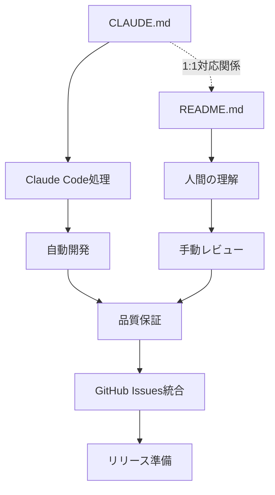
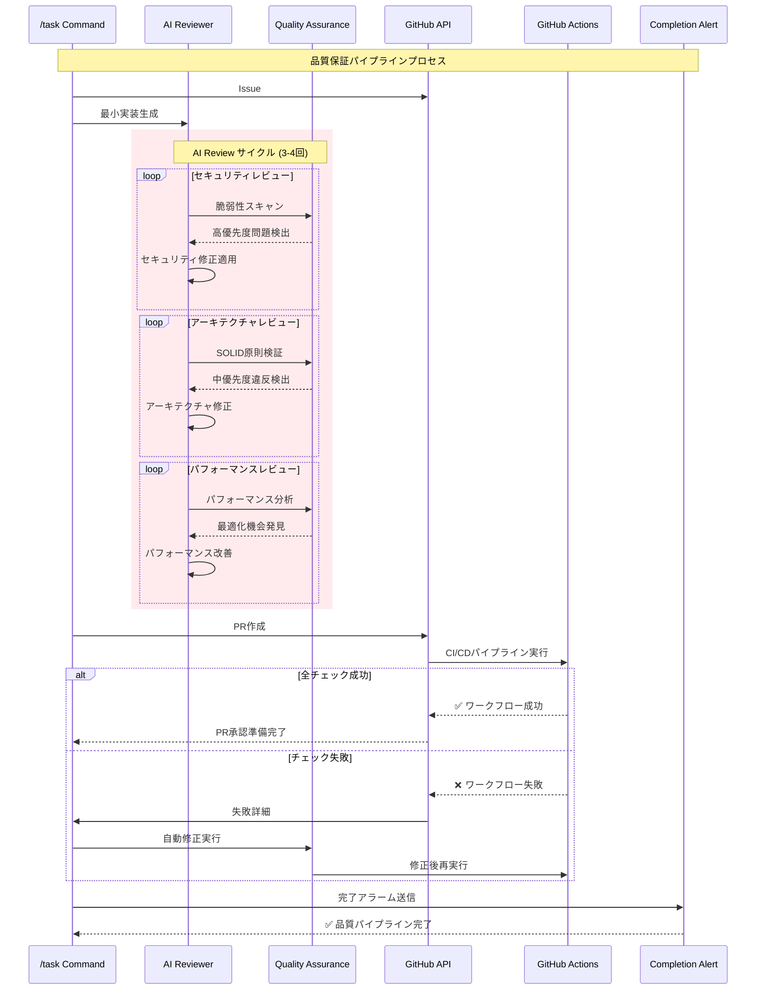

# Flutter Template Project

**CLAUDE.md と README.md の1:1対応による GitHub Issues 統合 AI支援開発プラットフォーム**

## ドキュメント構造と関係性

このプロジェクトは、AIと人間の両方に対応した包括的なドキュメント体系を採用しています：

### CLAUDE.md - README.md 統合システム



### ドキュメント構成

| ファイル      | 目的                               | 読者       | 関係性 |
| ------------- | ---------------------------------- | ---------- | ------ |
| **CLAUDE.md** | Claude Code用ワークフロー設定      | AIシステム | ←→     |
| **README.md** | 人間向けプロジェクト説明（本文書） | 開発チーム | ←→     |

**1:1対応の原則**: CLAUDE.mdの各セクションは、README.mdで対応する人間向け説明を持ちます。

### 言語設定

- **デフォルト言語**: Japanese（日本語）
- **README.md言語**: デフォルト言語設定に従い日本語で記述
- **多言語対応**: slang i18nシステムによる拡張可能

## プロジェクト概要

AI支援開発とモダンアーキテクチャを組み合わせた、GitHub Issues統合エンタープライズ対応Flutterアプリケーションテンプレートです。

### 核となる特徴

- **🤖 AI支援開発**: Claude CodeとGitHub Issuesの統合による自動開発
- **📋 GitHub Issues統合**: ネイティブGitHub Issue管理による効率的なタスク処理
- **📦 モノレポ構造**: Melosによる効率的なパッケージ管理
- **🎯 型安全性**: Riverpod、go_router、slangによる堅牢なアーキテクチャ
- **⚡ 開発効率**: 自動コード生成と高速開発サイクル
- **🔍 高度な品質保証**: AI Review-First方式による多段階品質管理

## セットアップ

| ツール  | 推奨バージョン | インストール方法                            |
| ------- | -------------- | ------------------------------------------- |
| Flutter | mise管理       | `mise install`                               |
| Bun     | 1.2+           | `curl -fsSL https://bun.sh/install \| bash` |
| Melos   | 7.0+           | `dart pub global activate melos`            |

### クイックスタート

````bash
# 1. プロジェクトを取得
git clone <repository-url>
cd flutter_template_project

# 2. 開発環境を構築

mise install
eval "$(mise activate bash)"
npm install

melos bootstrap

# 3. GitHub CLI認証（必須）
gh auth login

# 4. 環境変数設定
export ENABLE_BACKGROUND_TASKS=true
export TASK_MANAGEMENT_SYSTEM=github
export GITHUB_ACTIONS_CHECK=true

# 5. コード生成を実行
melos run gen

## アーキテクチャ概要

### システム構成図

```mermaid
graph TB
    subgraph "GitHub Integration"
        A[GitHub Issues] --> B[Claude Code /task]
        B --> C[Git Worktree]
        C --> D[Isolated Development]
    end

    subgraph "Flutter Architecture"
        E[Riverpod State] --> F[Go Router Navigation]
        F --> G[Slang i18n]
        G --> H[UI Components]
    end

    subgraph "Quality Assurance Pipeline"
        I[AI Review Cycles] --> J[Static Analysis]
        J --> K[Automated Tests]
        K --> L[GitHub Actions]
        L --> M[Quality Gates]
    end

    D --> E
    A --> I
    M --> N[Production Release]
````

### 技術スタック

| 分野               | 技術                             | 役割                             |
| ------------------ | -------------------------------- | -------------------------------- |
| **フレームワーク** | Flutter + mise                   | マルチプラットフォーム開発       |
| **状態管理**       | Riverpod + Hooks                 | リアクティブな状態アーキテクチャ |
| **ナビゲーション** | go_router                        | 型安全なルーティング             |
| **国際化**         | slang                            | コード生成による多言語対応       |
| **モノレポ**       | Melos                            | パッケージ統合管理               |
| **AI開発**         | Claude Code + GitHub Issues      | 自動化された開発ワークフロー     |
| **品質管理**       | AI Review-First + GitHub Actions | 多段階品質保証システム           |

## AI支援開発ワークフロー

### GitHub Issues統合プロセス

```mermaid
sequenceDiagram
    participant Dev as 開発者
    participant GitHub as GitHub Issues
    participant Claude as Claude Code
    participant Workspace as Git Worktree
    participant QA as 品質保証
    participant Actions as GitHub Actions

    Dev->>GitHub: Issue作成
    Dev->>Claude: /task #123
    Claude->>GitHub: Issue詳細取得
    Claude->>Workspace: 分離環境作成

    Note over Claude,QA: AI Review-First実装
    Claude->>QA: セキュリティレビュー
    Claude->>QA: アーキテクチャレビュー
    Claude->>QA: パフォーマンスレビュー
    Claude->>QA: 最終検証

    Claude->>GitHub: PR作成
    GitHub->>Actions: CI/CDパイプライン実行
    Actions->>QA: 品質ゲート検証
    QA->>Dev: 完了通知
    Dev->>GitHub: Issue完了
```

### /task コマンドの使用方法

```bash
# インタラクティブモード
/task
? Select Issues to process: #123, #456

# 直接実行モード
/task #123 #456

# 実行内容:
# ✅ GitHub Issue詳細の取得
# ✅ 分離された作業環境の作成
# ✅ AI Review-Firstによる実装
# ✅ 多段階品質保証の実行
# ✅ GitHub Actions統合
# ✅ 完了通知
```

## 品質管理システム

### AI Review-First品質保証パイプライン



### 品質基準

#### セキュリティ（高優先度）

- ✅ ハードコードされたシークレットなし
- ✅ 入力値検証の実装
- ✅ セキュアなデータストレージ
- ✅ ネットワーク通信の暗号化

#### アーキテクチャ（中優先度）

- ✅ SOLID原則の遵守
- ✅ 適切なデザインパターンの使用
- ✅ 論理的なコード構成

#### パフォーマンス（低優先度）

- ✅ 明らかなボトルネックなし
- ✅ 効率的なアルゴリズムの使用
- ✅ リソース使用量の最適化

## 開発コマンド

### Melosコマンド（推奨）

```bash
# 依存関係管理
melos run get      # 依存関係の更新
melos run gen      # コード生成（riverpod、freezed等）

# 品質管理
melos run analyze  # 静的解析
melos run test     # テスト実行
melos run format   # コード整形
melos run ci:format # CI用フォーマットチェック

# 多言語対応
melos run analyze:slang # 翻訳キー検証
```

### 直接Flutterコマンド

```bash
# アプリケーション実行
cd app && flutter run

# 個別テスト実行
cd app && flutter test test/widget_test.dart

# ビルド
cd app && flutter build apk
cd app && flutter build ios --no-codesign
```

## プロジェクト構成

```
flutter_template_project/
├── 📱 app/                      # メインアプリケーション
│   ├── lib/                     # アプリケーションコード
│   │   ├── main.dart           # エントリーポイント
│   │   ├── pages/              # UIページ
│   │   ├── router/             # go_router設定
│   │   └── i18n/               # 多言語対応ファイル
│   ├── assets/i18n/            # 翻訳JSONファイル
│   └── test/                   # ウィジェットテスト
├── 📦 packages/                 # 共有パッケージ
├── 🤖 .claude-workspaces/       # AI開発用分離環境
├── 📋 CLAUDE.md                 # AI用プロジェクト設定
├── 📋 README.md                 # 人間用プロジェクト説明（本文書）
├── 🔧 scripts/                 # 自動化スクリプト
├── 🔧 .claude/                 # Claude Code設定
│   └── commands/
│       └── task.md             # GitHub Issue処理コマンド
└── 📚 docs/                    # 専用ドキュメント
    ├── CLAUDE_4_BEST_PRACTICES.md # AI設計原則
    ├── MELOS_SETUP.md          # Melos設定詳細
    ├── VSCODE_SETTINGS.md      # エディタ設定
    └── WORKTREE_ARCHITECTURE.md # 並列開発アーキテクチャ
```

## 自動化されたワークフロー

### Workflow 1: コード品質保証

**目的**: 全開発活動において一貫したコード品質を保証

**実行内容**:

1. `melos run analyze` - 静的解析
2. `melos run ci:format` - フォーマット検証
3. `melos run test` - 自動テスト
4. `melos run analyze:slang` - 翻訳検証

### Workflow 2: ドキュメント同期

**目的**: CLAUDE.mdと関連ドキュメントの整合性維持

**実行内容**:

1. プロジェクト構造変更の監視
2. 自動更新による構造セクションの維持
3. Claude 4 Best Practices準拠の検証

### Workflow 3: 開発環境検証

**目的**: 適切な開発環境のセットアップと設定の保証

**実行内容**:

1. `mise` Flutter バージョン検証
2. GitHub CLI 設定確認
3. `git worktree` サポート検証
4. 環境変数の妥当性確認

## ドキュメント体系

### 包括的ドキュメント構成

| ドキュメント                                                       | 内容             | 対象者      | CLAUDE.md対応セクション |
| ------------------------------------------------------------------ | ---------------- | ----------- | ----------------------- |
| [README.md](README.md)                                             | プロジェクト概要 | 開発者      | 全体構成                |
| [CLAUDE.md](CLAUDE.md)                                             | AI開発設定       | Claude Code | 全体構成                |
| [docs/CLAUDE_4_BEST_PRACTICES.md](docs/CLAUDE_4_BEST_PRACTICES.md) | AI設計原則       | AI開発者    | AI Review-First         |
| [docs/MELOS_SETUP.md](docs/MELOS_SETUP.md)                         | モノレポ設定     | 開発者      | 開発コマンド            |
| [docs/VSCODE_SETTINGS.md](docs/VSCODE_SETTINGS.md)                 | エディタ設定     | 開発者      | 開発環境                |
| [docs/WORKTREE_ARCHITECTURE.md](docs/WORKTREE_ARCHITECTURE.md)     | 並列開発         | AI開発者    | Git Worktree            |
| [.claude/commands/task.md](.claude/commands/task.md)               | Issue処理        | Claude Code | カスタムコマンド        |

### Mermaid可視化の活用

このREADMEでは、以下の要素をMermaid記法で図式化しています：

1. **ドキュメント関係図**: CLAUDE.mdとREADME.mdの1:1対応関係
2. **システム構成図**: GitHub Issues統合アーキテクチャ全体の俯瞰
3. **AI開発フロー図**: GitHub Issues統合AI支援開発プロセスの可視化
4. **品質管理シーケンス図**: AI Review-First品質保証プロセスの詳細化

## 環境変数設定

### 必須設定

```bash
# Claude Code基本設定
export ENABLE_BACKGROUND_TASKS=true
export FLUTTER_VERSION_MANAGEMENT=mise
export TASK_MANAGEMENT_SYSTEM=github

# GitHub統合設定
export GITHUB_ACTIONS_CHECK=true
export CHECK_PR_WORKFLOW="check-pr.yml"

# 並列開発設定
export PARALLEL_DEVELOPMENT=git_worktree
export CLAUDE_ISOLATION_MODE=true
export CLAUDE_WORKSPACE_DIR=".claude-workspaces"

# UI・通知設定
export PR_LANGUAGE=japanese
export COMPLETION_NOTIFICATION=alarm
export INTERACTIVE_MODE=true
export ISSUE_SELECTION_UI=enabled
```

## 貢献方法

1. このリポジトリをフォーク
2. フィーチャーブランチを作成 (`git checkout -b feature/ISSUE-123`)
3. 変更をコミット (`git commit -m 'feat: add new feature [ISSUE-123]'`)
4. ブランチをプッシュ (`git push origin feature/ISSUE-123`)
5. プルリクエストを作成

### ブランチ命名規則

- **形式**: `feature/ISSUE-123` (Issue番号のみ)
- **禁止**: 日本語・英語での説明文追加は不可
- **理由**: 自動化されたワークフローとの整合性

## ライセンス

このプロジェクトは MIT ライセンスの下で公開されています。詳細は [LICENSE](LICENSE) を参照してください。

## サポート・コミュニティ

- 📖 [ドキュメント](docs/)
- 🐛 [Issue報告](https://github.com/your-org/flutter_template_project/issues)
- 💬 [ディスカッション](https://github.com/your-org/flutter_template_project/discussions)
- 🤖 [Claude Code統合ガイド](.claude/commands/task.md)

---

**CLAUDE.md と README.md の1:1対応により、AIと人間の両方に最適化されたGitHub Issues統合開発環境を提供します。**
