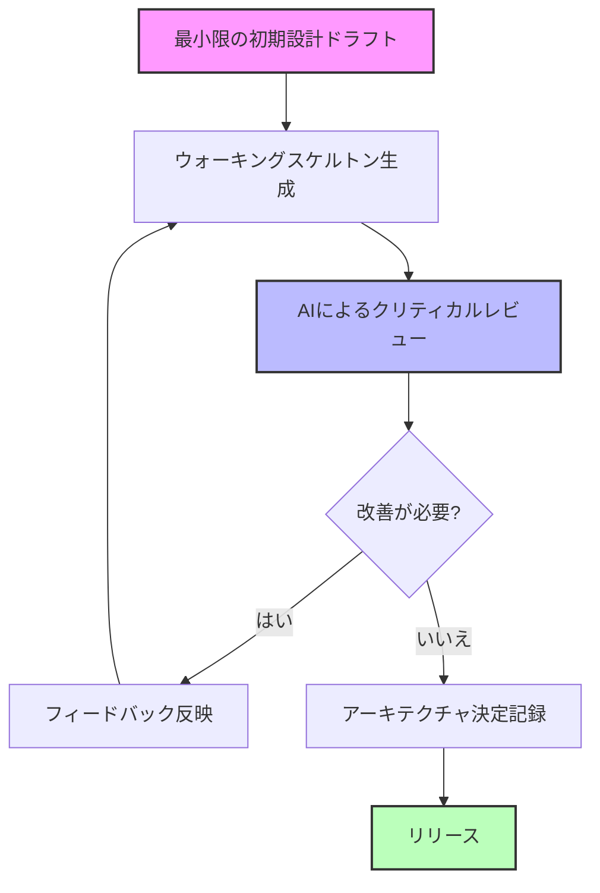
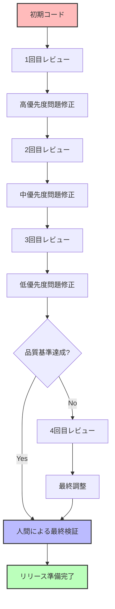
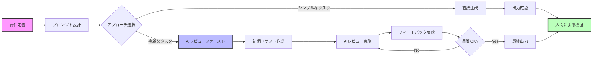

# Claude 4 プロンプトエンジニアリング ベストプラクティス

Claude 4を「シニアレビュアー」として活用するための実践的なガイドです。

## 参照元

- **Claude 4 ベストプラクティス**: https://docs.anthropic.com/en/docs/build-with-claude/prompt-engineering/claude-4-best-practices
- **AIレビューファースト設計**: https://zenn.dev/caphtech/articles/ai-review-first-design

## AIレビューファースト設計の導入

_参照元: https://zenn.dev/caphtech/articles/ai-review-first-design_

### 基本概念

LLM（大規模言語モデル）は、コードを一から生成するよりも、既存のコードを批評・レビューする方が効果的です。この方法論では：

- **小さなドラフト → 厳しい批評 → 再生成 → リリース** のサイクルを回す
- AIを「ジュニア設計者」ではなく「シニアレビュアー」として活用
- 3〜4回の反復レビューで品質を向上

### 開発ループ

1. **最小限の初期設計ドラフトを作成**
2. **ウォーキングスケルトンを生成**
3. **AIによるクリティカルレビュー**
4. **フィードバックに基づく反復的改善**
5. **アーキテクチャ決定の記録**



## 一般原則

_参照元: https://docs.anthropic.com/en/docs/build-with-claude/prompt-engineering/claude-4-best-practices#general-principles_

### 1. 明確な指示を提供する

具体的で明確なガイダンスを提供することで、より良い出力結果を得られます。

**悪い例:**

```text
分析ダッシュボードを作成して
```

**良い例:**

```text
分析ダッシュボードを作成してください。
含める機能:
- リアルタイムデータ更新
- フィルタリング機能
- データエクスポート (CSV, PDF)
- レスポンシブデザイン
```

### 2. コンテキストを追加してパフォーマンスを向上させる

指示の背後にある動機や理由を説明することで、Claudeがより良い理解と目的に合った応答を提供できます。

### 3. 例とディテールに注意を払う

- 提供する例が望ましい動作と一致していることを確認する
- 望ましい結果を促すために詳細を慎重に作成する

## 主要な戦略

### 1. クリティカルレビューテンプレートの活用

_参照元: https://zenn.dev/caphtech/articles/ai-review-first-design#critical-review-template_

```text
以下のコードをレビューしてください。

評価カテゴリ:
1. セキュリティ脆弱性 (高優先度)
2. SOLID原則違反 (中優先度)
3. パフォーマンス最適化 (低優先度)

制約: 400文字以内で要約
```

### 2. レスポンスフォーマットの制御

_参照元: https://docs.anthropic.com/en/docs/build-with-claude/prompt-engineering/claude-4-best-practices#controlling-response-formatting_

#### やるべきことを伝える（避けるべきことではなく）

**悪い例:**

```text
長い説明は避けてください
```

**良い例:**

```text
3行以内で説明してください
```

#### XMLタグを使用して形式を示す

```xml
<response>
  <summary>簡潔な要約</summary>
  <details>詳細な説明</details>
</response>
```

#### プロンプトスタイルを出力スタイルに合わせる

プロンプトの書き方（フォーマル/カジュアル）が出力スタイルに影響します。

### 3. 思考能力を活用する

_参照元: https://docs.anthropic.com/en/docs/build-with-claude/prompt-engineering/claude-4-best-practices#leverage-thinking-capabilities_

マルチステップの推論と反映を促すプロンプトを使用します。

```text
ツール結果受領後:
1. 品質を評価
2. 問題点を特定
3. 次のアクションを決定
```

### 4. ツール使用の最適化

_参照元: https://docs.anthropic.com/en/docs/build-with-claude/prompt-engineering/claude-4-best-practices#optimize-for-tool-use_

#### 並列ツール呼び出しを促す

```text
# 並列実行で最大効率化
関連ツールを同時呼び出し
```

### 5. フロントエンドとコード生成

_参照元: https://docs.anthropic.com/en/docs/build-with-claude/prompt-engineering/claude-4-best-practices#frontend-and-code-generation_

#### 明確な奨励を提供する

- 「可能な限り多くの関連機能を含めてください」などの修飾子を使用
- ホバー状態、トランジション、アニメーションなど特定のデザイン要素を要求

```text
ダッシュボード要件:
✓ hover時の視覚フィードバック
✓ 300ms以内のアニメーション
✓ モバイル/タブレット/PC対応
✓ WCAG 2.1 AA準拠
```

### 6. テストへの過度な焦点を避ける

_参照元: https://docs.anthropic.com/en/docs/build-with-claude/prompt-engineering/claude-4-best-practices#avoid-overfocusing-on-tests_

- ロバストで汎用的なソリューションの作成を強調
- 問題要件の理解に焦点を当てる
- 原則に基づいた保守可能なコードの実装

## AIレビューファースト設計の実践

_参照元: https://zenn.dev/caphtech/articles/ai-review-first-design#implementation-strategy_

### 実装戦略

1. **高リスク領域に初期フォーカス**

   - セキュリティ関連のコード
   - パフォーマンスクリティカルな部分
   - ビジネスロジックのコア部分

2. **反復レビューのベストプラクティス**
   - レビューサイクルは3〜4回が最適
   - 各レビューは400文字以内に制限
   - 常に人間による最終検証を実施
   - バージョン固有の参照を使用



### 制限事項の認識

_参照元: https://zenn.dev/caphtech/articles/ai-review-first-design#limitations_

AIレビューファースト設計が効果的でないケース：

- 1000行以上の複雑なシステム設計
- ドメイン固有の技術コンテキスト
- 最先端技術領域

## 実践的なヒント

### 効果的なプロンプトの構造

```yaml
structure:
  context: 'プロジェクト背景と制約'
  goal: '明確な成果物'
  requirements:
    - 機能要件
    - 非機能要件
  output_format: 'JSON/Markdown/Code'
  quality_criteria:
    - テストカバレッジ
    - パフォーマンス指標
```

### よくある落とし穴と回避方法

1. **曖昧な指示**

   - 避ける: 「良いコードを書いて」
   - 使用する: 「SOLID原則に従い、適切なエラーハンドリングとドキュメントを含むコードを書いて」

2. **否定的な指示**

   - 避ける: 「バグのあるコードを書かないで」
   - 使用する: 「テスト済みでエラーハンドリングが適切なコードを書いて」

3. **コンテキスト不足**
   - 避ける: 「関数を作成して」
   - 使用する: 「ユーザー認証のための関数を作成して。JWT トークンを使用し、セキュリティベストプラクティスに従ってください」

## 実例: AIレビューファーストプロンプト

### コード生成とレビューの組み合わせ

```python
# ステップ1: 最小実装
"""
JWTベースのユーザー認証機能を実装してください。
必須機能のみ: login(), logout(), verify_token()
"""

# ステップ2: AIレビュー
"""
セキュリティ観点でコードをレビュー:
- SQLインジェクション対策
- トークン有効期限検証
- パスワードハッシュ化

400文字以内で要約。
"""

# ステップ3: 改善実装
"""
高優先度のセキュリティ問題を修正。
"""
```

## Claude 4活用の全体ワークフロー



## まとめ

Claude 4を最大限に活用するためには：

1. **AIレビューファースト設計**を採用し、AIを「シニアレビュアー」として活用
2. **明確で具体的な指示**を提供する
3. **構造化されたレビューテンプレート**を使用する
4. **反復的な改善サイクル**（3〜4回）を実施
5. **制限事項を理解**し、適切なケースで使用する
6. **人間による最終検証**を必ず実施する

「小さなドラフト → 厳しい批評 → 再生成 → リリース」のサイクルが、高品質な成果物を生み出す鍵です。
