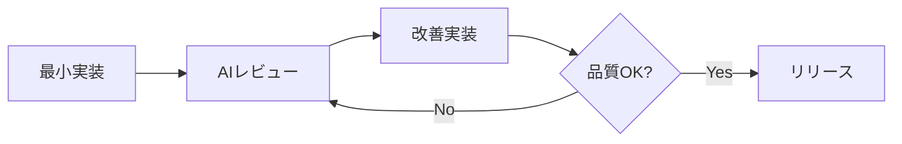
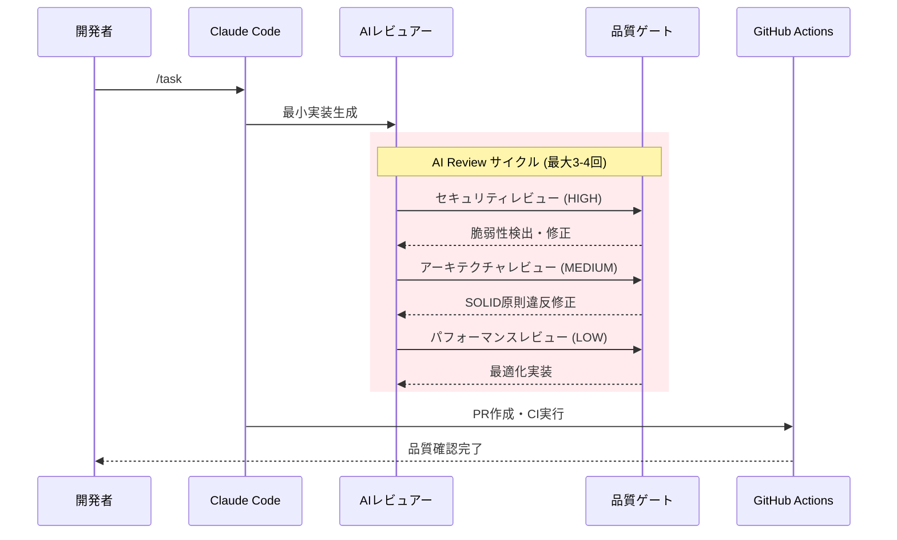

# プロジェクト概要

## AI支援Flutter開発テンプレート

**Claude CodeとGitHub Issuesを活用したモダンFlutterアプリケーション開発プラットフォーム**

このプロジェクトは、AI技術とモダンな開発ツールを統合し、従来のFlutter開発プロセスを革新的に効率化するテンプレートプロジェクトです。

### 核となる特徴

- **🤖 AI支援開発**: Claude Code統合によるGitHub Issue駆動の自動開発
- **📦 モノレポ構造**: Melosによる効率的なマルチパッケージ管理
- **🎯 型安全性**: Riverpod、go_router、slangによる堅牢なアーキテクチャ
- **⚡ 開発効率**: 自動コード生成とHot Reloadによる高速開発サイクル
- **🔍 高度な品質保証**: AI Review-First方式による多段階品質管理
- **🔄 並列開発**: git worktreeによる分離された開発環境
- **📋 Issue統合**: `/task` コマンドによるシームレスなGitHub Issue処理
- **📝 Issue生成**: `/file-to-issue` コマンドによる要件ファイルからの自動Issue化

## 技術スタック

| 分野               | 技術                             | 役割                             |
| ------------------ | -------------------------------- | -------------------------------- |
| **フレームワーク** | Flutter + mise                   | マルチプラットフォーム開発       |
| **状態管理**       | Riverpod + Hooks                 | リアクティブな状態アーキテクチャ |
| **ナビゲーション** | go_router                        | 型安全なルーティング             |
| **国際化**         | slang                            | コード生成による多言語対応       |
| **モノレポ**       | Melos                            | パッケージ統合管理               |
| **AI開発**         | Claude Code + GitHub Issues      | 自動化された開発ワークフロー     |
| **品質管理**       | AI Review-First + GitHub Actions | 多段階品質保証システム           |
| **並列開発**       | git worktree                     | 分離された作業環境               |
| **バージョン管理** | mise                             | 統一されたツールバージョン管理   |
| **パッケージ管理** | Bun (Node.js代替)                | 高速なJavaScriptパッケージ管理   |

## AI Review-First開発手法

### 核心原則

本プロジェクトは **Claude 4 Best Practices** に基づく「AI Review-First設計」を採用しています。

**「小さなドラフト → 厳しい批評 → 再生成 → リリース」**



### AI支援開発サイクル

#### 1. ファイルからIssue生成（`/file-to-issue`コマンド）

任意のファイル（要件定義書、アイデアメモ等）からAI向けプロンプトに変換し、GitHub Issueを自動起票します。

```bash
# 任意のファイルからGitHub Issueを起票
/file-to-issue

# 実行される処理:
# ✅ ファイル内容の解析・構造化
# ✅ AI向けプロンプト形式への変換
# ✅ GitHub Issueの自動起票
# ✅ `/task`コマンドによる実装開始への準備
```

**使用例**:

1. 要件定義書やアイデアファイルを準備
2. `/file-to-issue`で課題として起票
3. `/task`で実装を開始

#### 2. GitHub Issue処理（`/task`コマンド）

GitHub Issueを取得し、AI Review-First方式で自動実装を行います。

```bash
# インタラクティブモード（Issue選択UI表示）
/task

# 直接実行モード（Issue番号指定）
/task #123 #456
```

**実行される処理**:

- GitHub Issue詳細の取得
- git worktreeによる分離環境作成
- AI Review-Firstによる実装
- 多段階品質保証の実行
- GitHub Actions統合
- 完了通知

#### 3. 3段階品質レビュー

| 優先度 | カテゴリ       | 評価基準                                                         |
| ------ | -------------- | ---------------------------------------------------------------- |
| **高** | セキュリティ   | ハードコードされたシークレット、入力値検証、セキュアなデータ保存 |
| **中** | アーキテクチャ | SOLID原則、適切な分離、デザインパターンの使用                    |
| **低** | パフォーマンス | ボトルネックなし、効率的なアルゴリズム、リソース最適化           |

#### 4. 品質ゲート

- [ ] 全HIGH優先度のセキュリティ問題解決
- [ ] SOLID原則違反の修正
- [ ] 静的解析クリア（`melos run analyze`）
- [ ] 全テスト通過（`melos run test`）
- [ ] 翻訳検証クリア（`melos run analyze:slang`）

## git worktree並列開発

### 分離された開発環境

```bash
# 現在のworktreeリスト確認
git worktree list

# Issueごとの分離環境
.claude-workspaces/
├── issue-123/          # Issue #123専用環境
├── issue-456/          # Issue #456専用環境
└── main/               # メイン開発環境
```

### 並列開発の利点

- **環境独立性**: 各Issueが独立したFlutter環境を持つ
- **競合防止**: 異なるブランチでの同時開発が可能
- **効率向上**: 複数Issue並行処理による開発速度向上
- **品質向上**: 分離された環境でのテスト実行

## アーキテクチャ概要

### 状態管理パターン

**Riverpod + Hooks** による宣言的UI：

```dart
@riverpod
class CounterNotifier extends _$CounterNotifier {
  @override
  int build() => 0;

  void increment() => state++;
}

// UI での使用
class CounterPage extends ConsumerWidget {
  Widget build(context, ref) {
    final count = ref.watch(counterNotifierProvider);
    return Text('Count: $count');
  }
}
```

### 国際化アプローチ

**slang** による型安全な多言語対応：

```dart
// assets/i18n/ja.i18n.json
{
  "welcome": "ようこそ",
  "settings": {
    "title": "設定"
  }
}

// UI での使用
Text(context.i18n.welcome)
Text(context.i18n.settings.title)
```

## テスト戦略

| テストレベル | 対象              | ツール           |
| ------------ | ----------------- | ---------------- |
| ユニット     | ビジネスロジック  | flutter_test     |
| ウィジェット | UI コンポーネント | flutter_test     |
| 統合         | ユーザーフロー    | integration_test |

```bash
# 全テスト実行
melos run test

# カバレッジ付き実行
melos run test --coverage
```

## 統合品質管理システム

### AI Review-First品質パイプライン



### 品質保証ツールチェーン

| カテゴリ               | ツール                    | 役割                                             | 実行タイミング |
| ---------------------- | ------------------------- | ------------------------------------------------ | -------------- |
| **AI品質レビュー**     | Claude 4 Review-First     | セキュリティ・アーキテクチャ・パフォーマンス分析 | 実装時         |
| **静的解析**           | Dart Analyzer             | コード品質・型安全性検証                         | CI/CD          |
| **コードフォーマット** | Dart Formatter + Prettier | 一貫したコードスタイル                           | 自動実行       |
| **テスト自動化**       | Flutter Test Framework    | ユニット・ウィジェット・統合テスト               | CI/CD          |
| **翻訳検証**           | slang analyzer            | 多言語対応の整合性確認                           | CI/CD          |
| **コミット規約**       | commitlint                | Conventional Commits準拠                         | コミット時     |
| **GitHub Actions**     | 統合CI/CD                 | 全品質ゲートの自動実行                           | PR作成時       |

### mise統合開発コマンド

```bash
# 完全開発ワークフロー（推奨）
mise run dev          # get → gen → analyze → test → format

# 品質保証ワークフロー
mise run quality      # analyze → test → format-all

# CI/CD互換チェック
mise run ci-check     # GitHub Actionsと同等の検証

# 個別コマンド
mise run analyze      # 静的解析
mise run test         # テスト実行
mise run format-all   # 全ファイル整形
mise run gen          # コード生成
```

### コミット規約とブランチ戦略

#### Conventional Commits準拠

```bash
feat: 新機能追加
fix: バグ修正
docs: ドキュメント更新
style: コードスタイル変更
refactor: リファクタリング
test: テスト関連
chore: その他のメンテナンス

# 例:
feat: add user authentication with Riverpod [ISSUE-123]
fix: resolve navigation state persistence bug [ISSUE-456]
```

#### ブランチ命名規則

```bash
# 推奨形式（Issue番号のみ）
feature/ISSUE-123
feature/ISSUE-456

# 禁止（説明文は不要）
❌ feature/ISSUE-123-user-authentication
❌ feature/add-user-auth
```

## 開発環境セットアップ

### 必要ツール

| ツール         | バージョン | インストール方法                     |
| -------------- | ---------- | ------------------------------------ |
| **mise**       | 2024.12+   | `curl https://mise.run \| sh`        |
| **bun**        | 1.2.17     | miseで管理（自動インストール）       |
| **GitHub CLI** | 2.40+      | `brew install gh` / `apt install gh` |
| **Git**        | 2.40+      | システム標準                         |

### クイックスタート

```bash
# 1. リポジトリクローン
git clone <repository-url>
cd flutter_template_project

# 2. 開発環境構築
mise install                    # Flutter・Dart自動インストール
eval "$(mise env)"             # mise環境変数を適用
mise run setup                 # プロジェクトセットアップ

# 3. GitHub CLI認証（必須）
gh auth login

# 4. 環境変数設定
export ENABLE_BACKGROUND_TASKS=true
export TASK_MANAGEMENT_SYSTEM=github
export GITHUB_ACTIONS_CHECK=true

# 5. 初期セットアップ検証
mise run dev                    # 開発ワークフロー実行（テスト含む）

# 6. アプリケーション起動
mise run run                    # デバッグモード
mise run run-release            # リリースモード
```

## まとめ

本プロジェクトは、**Claude 4 Best Practices**に基づく**AI Review-First設計**と**GitHub Issues統合**により、従来のFlutter開発プロセスを大幅に効率化・高品質化します。

### 主要な革新点

1. **AI支援開発**: Claude Codeによる自動Issue処理と品質レビュー
2. **並列開発**: git worktreeによる複数Issue同時開発
3. **統一ツールチェーン**: miseによる一貫した開発環境管理
4. **多段階品質保証**: セキュリティ → アーキテクチャ → パフォーマンスの段階的レビュー
5. **完全自動化**: `/file-to-issue`と`/task`コマンドによる要件から本番デプロイまでの一気通貫ワークフロー

このアプローチにより、**高品質**かつ**高速**なFlutterアプリケーション開発を実現します。
