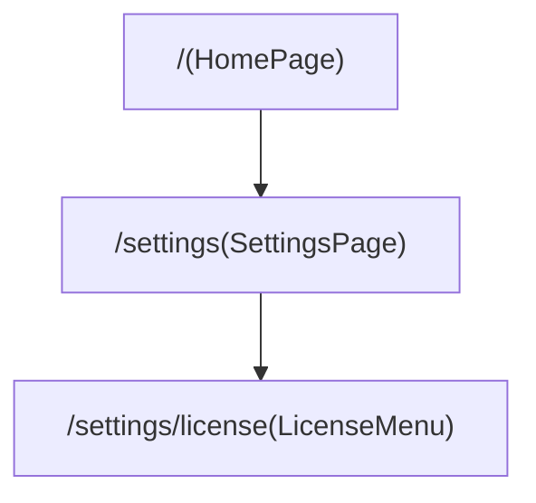

# ルート定義

アプリケーションの画面遷移とルーティングの定義をまとめたドキュメントです。

## ルート図

ルートの階層構造を視覚的に示します。

## ルート詳細

各ルートの詳細な情報を以下に示します。

| パス                | 画面           | 概要                   |
| ------------------- | -------------- | ---------------------- |
| `/`                 | `HomePage`     | アプリケーションのメイン画面 |
| `/settings`         | `SettingsPage` | 設定画面               |
| `/settings/license` | `LicenseMenu`  | ライセンス情報画面       |
