# Git Worktree配置アーキテクチャ

## 概要

このドキュメントでは、Claude CodeとLinearを連携したFlutter並行開発システムにおいて、なぜ`worktrees`ディレクトリをプロジェクトルートに配置し、`.git`ディレクトリ直下に配置しないのかについて説明します。

## 目次

1. [現在の配置方針](#現在の配置方針)
2. [.gitディレクトリ直下への配置が問題となる理由](#gitディレクトリ直下への配置が問題となる理由)
3. [ルートディレクトリ配置の利点](#ルートディレクトリ配置の利点)
4. [技術的考慮事項](#技術的考慮事項)
5. [代替案との比較](#代替案との比較)
6. [まとめ](#まとめ)

## 現在の配置方針

### ディレクトリ構造

```bash
flutter_template_project/
├── .claude-workspaces/          # ✅ ルート直下に配置（推奨）
│   ├── FEAT-123/                # タスク1の独立作業ディレクトリ
│   ├── UI-456/                  # タスク2の独立作業ディレクトリ
│   └── BUG-789/                 # タスク3の独立作業ディレクトリ
├── .git/                        # Git内部管理用
│   ├── worktrees/              # ⚠️ Gitの内部管理用（既存）
│   ├── refs/
│   ├── objects/
│   └── config
├── app/                         # メインFlutterアプリケーション
├── packages/                    # 共有パッケージ
├── docs/                        # ドキュメント
└── .claude/                     # Claude設定
```

### Git Worktreeアーキテクチャ概要

```mermaid
flowchart TB
    subgraph "プロジェクトルート"
        MainRepo["🗂️ flutter_template_project<br/>(メインリポジトリ)"] 
        
        subgraph "作業ディレクトリ"
            CW[".claude-workspaces/"]
            CW --> W1["FEAT-123/<br/>🔧 新機能開発"]
            CW --> W2["UI-456/<br/>🎨 UI改善"]
            CW --> W3["BUG-789/<br/>🐛 バグ修正"]
        end
        
        subgraph "Git内部管理"
            GitDir[".git/"]
            GitDir --> GM["worktrees/<br/>📝 メタデータ管理"]
        end
        
        subgraph "共有リソース"
            App["app/<br/>📱 メインアプリ"]
            Pkg["packages/<br/>📦 共有パッケージ"]
            Docs["docs/<br/>📚 ドキュメント"]
            Claude[".claude/<br/>⚙️ Claude設定"]
        end
    end
    
    W1 -.->|参照| App
    W1 -.->|参照| Pkg
    W1 -.->|参照| Claude
    
    W2 -.->|参照| App
    W2 -.->|参照| Pkg
    W2 -.->|参照| Claude
    
    W3 -.->|参照| App
    W3 -.->|参照| Pkg
    W3 -.->|参照| Claude
    
    GM -.->|管理| W1
    GM -.->|管理| W2
    GM -.->|管理| W3
    
    classDef workspace fill:#e3f2fd,stroke:#1976d2,stroke-width:2px
    classDef shared fill:#f3e5f5,stroke:#7b1fa2,stroke-width:2px
    classDef internal fill:#fff3e0,stroke:#f57c00,stroke-width:2px
    
    class W1,W2,W3 workspace
    class App,Pkg,Docs,Claude shared
    class GitDir,GM internal
```



## .gitディレクトリ直下への配置が問題となる理由

### 1. 隠しディレクトリによるアクセシビリティ問題

#### 問題のある配置例

```bash
flutter_template_project/
├── .git/
│   ├── worktrees/              # ❌ 隠しディレクトリ内で見えにくい
│   │   ├── feature-FEAT-123/
│   │   └── feature-UI-456/
```

#### 具体的な問題

- **ファイルマネージャー**: 多くのツールで隠しディレクトリが表示されない
- **開発者体験**: 作業場所が把握しにくい
- **新規参加者**: プロジェクト構造の理解が困難

### 2. IDE・エディタの認識問題

#### VS Code での問題例

```json
// .vscode/settings.json が正しく認識されない
{
  "dart.flutterSdkPath": "/path/to/flutter",
  "dart.analysisServerFolder": ".dart_tool"
}
```

#### IntelliJ IDEA での問題例

```bash
.git/worktrees/feature-FEAT-123/apps/
# ↑ IDEがプロジェクトルートとして認識しにくい
# ↑ Flutter SDKの検出に失敗する可能性
# ↑ 設定ファイル（.idea/）が正しく動作しない
```

#### 影響範囲

- Flutter SDK の自動検出失敗
- デバッガーやホットリロードの問題
- プラグインや拡張機能の誤動作
- コード補完・解析機能の低下

### 3. Git内部構造との競合

#### Gitの既存構造

```bash
.git/
├── worktrees/                  # ⚠️ Gitが既に使用中
│   ├── feature-FEAT-123/       # worktreeのメタデータ
│   │   ├── HEAD               # ブランチ参照
│   │   ├── commondir          # 共通ディレクトリ参照
│   │   ├── gitdir             # .gitディレクトリ参照
│   │   └── locked             # ロック状態
```

#### 競合による問題

- **名前空間の衝突**: 同名ディレクトリでの混乱
- **内部コマンドの誤動作**: `git worktree prune`等での予期しない動作
- **メタデータの破損リスク**: Git更新時の互換性問題
- **デバッグの困難**: 内部ファイルと作業ファイルの区別が困難

### 4. バックアップ・同期ツールでの除外

#### 一般的なバックアップ設定

```bash
# rsyncでの除外設定
rsync --exclude='.git' source/ dest/
# ↑ .git配下のworktreesも除外されてしまう

# .gitignore_global
.git/
# ↑ 多くの同期ツールで除外対象
```

#### 影響するツール

- **クラウド同期**: Google Drive, Dropbox, OneDrive
- **バックアップソフト**: Time Machine, Carbon Copy Cloner
- **CI/CDシステム**: GitHub Actions, GitLab CI

### 5. 権限・セキュリティ問題

#### 権限設定の制約

```bash
# .gitディレクトリの一般的な権限
drwxr-xr-x  .git/                # 読み取り制限

# 作業ディレクトリに必要な権限
drwxrwxrwx  worktrees/feature-FEAT-123/  # 読み書き実行権限
```

#### セキュリティポリシーでの制約

- 企業環境での`.git`アクセス制限
- セキュリティソフトによる隠しディレクトリ監視
- CI/CDでの権限エラー

### 6. 管理スクリプトの複雑化

#### 現在のスクリプト（シンプル）

```bash
# scripts/manage-flutter-tasks.sh
for worktree in worktrees/*/; do
    if [ -d "$worktree" ]; then
        cd "$worktree"
        flutter analyze
        cd - > /dev/null
    fi
done
```

#### .git配下の場合（複雑）

```bash
# 複雑な処理が必要
for worktree in .git/worktrees/*/; do
    # 隠しディレクトリチェック
    if [[ "$(basename "$worktree")" != "."* ]]; then
        # 権限チェック
        if [ -r "$worktree" ] && [ -w "$worktree" ]; then
            # Git内部ファイルとの区別
            if [ -f "$worktree/apps/pubspec.yaml" ]; then
                cd "$worktree"
                flutter analyze
                cd - > /dev/null
            fi
        fi
    fi
done
```

## ルートディレクトリ配置の利点

### 1. 明確な可視性

```bash
flutter_template_project/
├── worktrees/                   # ✅ 一目で作業ディレクトリと分かる
│   ├── feature-FEAT-123/        # ✅ 各タスクが明確
│   └── feature-UI-456/          # ✅ 進行中のタスクが把握しやすい
```

### 2. IDE・エディタでの適切な認識

```bash
# VS Codeでの認識例
worktrees/feature-FEAT-123/apps/
├── .vscode/                     # ✅ 設定ファイルが正しく動作
├── lib/                         # ✅ Dartコード解析が正常
├── pubspec.yaml                 # ✅ Flutter SDKが正しく検出
└── analysis_options.yaml       # ✅ Lintルールが適用
```

### 3. 並行開発での独立性

```bash
# 各タスクが完全に独立
cd worktrees/feature-FEAT-123    # タスク1: 新機能開発
flutter run --device=android

cd ../feature-UI-456             # タスク2: UI改善
flutter run --device=ios

cd ../feature-BUG-789            # タスク3: バグ修正
flutter test --coverage
```

### 4. 管理スクリプトでの効率的な処理

```bash
# シンプルで効率的な処理
./scripts/manage-flutter-tasks.sh list
# ↓
📋 Active Flutter Tasks:
   - FEAT-123: ✅ Running (Android)
   - UI-456:   ✅ Running (iOS)
   - BUG-789:  🧪 Testing
```

### 5. 共通リソースへの適切なアクセス

```bash
worktrees/feature-FEAT-123/
├── apps/                        # このタスク専用のFlutterアプリ
├── ../../.claude/               # ✅ 共通のClaude設定
├── ../../scripts/               # ✅ 共通の管理スクリプト
├── ../../docs/                  # ✅ 共通ドキュメント
└── ../../screenshots/           # ✅ 共通スクリーンショット
```

## 技術的考慮事項

### 1. Git Worktreeの仕組み

#### Git Worktree内部構造図

```mermaid
flowchart LR
    subgraph "メインリポジトリ"
        MainGit[".git/"]
        MainGit --> Objects["objects/<br/>📦 オブジェクト"]
        MainGit --> Refs["refs/<br/>🔗 参照"]
        MainGit --> Config["config<br/>⚙️ 設定"]
        MainGit --> WMeta["worktrees/<br/>📝 メタデータ"]
        
        subgraph "Worktreeメタデータ"
            WMeta --> W1Meta["FEAT-123/<br/>HEAD, commondir, gitdir"]
            WMeta --> W2Meta["UI-456/<br/>HEAD, commondir, gitdir"]
            WMeta --> W3Meta["BUG-789/<br/>HEAD, commondir, gitdir"]
        end
    end
    
    subgraph "作業ディレクトリ"
        CWS[".claude-workspaces/"]
        CWS --> CW1["FEAT-123/"]
        CWS --> CW2["UI-456/"]
        CWS --> CW3["BUG-789/"]
        
        CW1 --> GitRef1[".git<br/>(参照ファイル)"]
        CW2 --> GitRef2[".git<br/>(参照ファイル)"]
        CW3 --> GitRef3[".git<br/>(参照ファイル)"]
        
        CW1 --> AppCode1["app/<br/>📱 アプリコード"]
        CW2 --> AppCode2["app/<br/>📱 アプリコード"]
        CW3 --> AppCode3["app/<br/>📱 アプリコード"]
    end
    
    W1Meta -.->|管理| GitRef1
    W2Meta -.->|管理| GitRef2
    W3Meta -.->|管理| GitRef3
    
    GitRef1 -.->|参照| MainGit
    GitRef2 -.->|参照| MainGit
    GitRef3 -.->|参照| MainGit
    
    classDef meta fill:#fff3e0,stroke:#f57c00,stroke-width:2px
    classDef workspace fill:#e3f2fd,stroke:#1976d2,stroke-width:2px
    classDef reference fill:#e8f5e8,stroke:#388e3c,stroke-width:2px
    
    class MainGit,WMeta,W1Meta,W2Meta,W3Meta meta
    class CWS,CW1,CW2,CW3,AppCode1,AppCode2,AppCode3 workspace
    class GitRef1,GitRef2,GitRef3 reference
```



#### 内部動作

```bash
# worktree作成時の内部処理
git worktree add .claude-workspaces/FEAT-123 feature/FEAT-123

# 内部で作成されるファイル
.git/worktrees/FEAT-123/
├── HEAD                        # ブランチ参照
├── commondir                   # ../../
├── gitdir                      # .claude-workspaces/FEAT-123/.git
└── locked                      # 使用中フラグ
```

#### worktreeディレクトリの構造

```bash
.claude-workspaces/FEAT-123/
├── .git                        # → .git/worktrees/FEAT-123/への参照
├── app/                        # Flutterアプリケーション
├── packages/                   # 共有パッケージ
└── docs/                       # ドキュメント
```

### 2. Claude Codeとの連携

#### 並行開発フロー図

```mermaid
sequenceDiagram
    participant User as 👤 開発者
    participant Linear as 📋 Linear
    participant Claude as 🤖 Claude Code
    participant Git as 📚 Git Worktree
    participant Flutter as 📱 Flutter
    
    User->>Claude: /linear FEAT-123
    Claude->>Linear: Issue詳細取得
    Linear-->>Claude: Issue情報
    
    Claude->>Git: worktree作成
    Note over Git: .claude-workspaces/FEAT-123/
    Git-->>Claude: 作業環境準備完了
    
    Claude->>Flutter: 環境セットアップ
    Note over Flutter: flutter pub get<br/>コード生成
    Flutter-->>Claude: セットアップ完了
    
    loop 開発サイクル
        Claude->>Claude: コード実装
        Claude->>Flutter: テスト実行
        Flutter-->>Claude: 結果
        Claude->>Git: コミット
    end
    
    Claude->>Git: PR作成
    Claude->>Linear: Issue更新
    Linear-->>User: 完了通知
```



#### プロセス管理での利点

```bash
# PIDファイルでの管理
pids/
├── claude-flutter-FEAT-123.pid  # ✅ タスクIDが明確
├── claude-flutter-UI-456.pid    # ✅ プロセス特定が容易
└── claude-flutter-BUG-789.pid   # ✅ 管理スクリプトで一元処理
```

#### ログ管理での利点

```bash
# ログファイルでの追跡
logs/
├── claude-flutter-FEAT-123.log  # ✅ タスク別ログが明確
├── claude-flutter-UI-456.log    # ✅ デバッグが容易
└── claude-flutter-BUG-789.log   # ✅ 進捗監視が効率的
```

### 3. リソース管理

#### メモリ・CPU使用量

```bash
# 各worktreeでの独立実行
worktrees/feature-FEAT-123/: CPU 15.2%, MEM 8.1%
worktrees/feature-UI-456/:   CPU 8.7%,  MEM 5.3%
worktrees/feature-BUG-789/:  CPU 12.1%, MEM 6.8%
```

#### ディスク使用量

```bash
# 効率的な容量管理
du -sh worktrees/*/
480M    worktrees/feature-FEAT-123/
320M    worktrees/feature-UI-456/
180M    worktrees/feature-BUG-789/
```

## 配置方式の比較分析

### 配置方式比較表

```mermaid
flowchart TD
    subgraph "配置方式の選択肢"
        A["🏠 ルート直下配置<br/>.claude-workspaces/<br/>(現在採用)"]
        B["🔒 .git直下配置<br/>.git/worktrees/<br/>(非推奨)"]
        C["📁 専用ディレクトリ配置<br/>dev/branches/<br/>(代替案)"]
        D["📂 サブディレクトリ配置<br/>workspace/tasks/<br/>(検討案)"]
    end
    
    subgraph "評価基準"
        E1["👁️ 可視性"]
        E2["🔧 IDE認識"]
        E3["📝 管理の容易さ"]
        E4["💾 バックアップ対象"]
        E5["🔐 権限問題"]
    end
    
    A --> Score1["✅✅✅✅✅<br/>総合: 優秀"]
    B --> Score2["❌❌❌❌❌<br/>総合: 問題あり"]
    C --> Score3["✅✅⚠️✅✅<br/>総合: 良好"]
    D --> Score4["✅✅⚠️✅✅<br/>総合: 良好"]
    
    classDef current fill:#e8f5e8,stroke:#2e7d32,stroke-width:3px
    classDef bad fill:#ffebee,stroke:#c62828,stroke-width:2px
    classDef alternative fill:#e3f2fd,stroke:#1565c0,stroke-width:2px
    
    class A,Score1 current
    class B,Score2 bad
    class C,D,Score3,Score4 alternative
```



## 代替案との比較

### 1. 現在の方式（推奨）

```bash
flutter_template_project/
├── worktrees/                   # ✅ ルート直下
```

**利点:**

- ✅ 明確な可視性
- ✅ IDE・エディタでの適切な認識
- ✅ 管理スクリプトのシンプル性
- ✅ バックアップ・同期の容易性

### 2. .git直下配置（非推奨）

```bash
flutter_template_project/
├── .git/
│   ├── worktrees/              # ❌ 隠しディレクトリ
```

**問題点:**

- ❌ 隠しディレクトリで見えにくい
- ❌ IDE・エディタでの認識問題
- ❌ Git内部構造との競合
- ❌ バックアップから除外される

### 3. 専用ディレクトリ配置（代替案）

```bash
flutter_template_project/
├── dev/
│   ├── branches/               # 🔄 代替可能
```

**評価:**

- 🔄 可視性は良好
- 🔄 管理の複雑化
- 🔄 既存スクリプトの変更が必要

### 4. サブディレクトリ配置（検討案）

```bash
flutter_template_project/
├── workspace/
│   ├── tasks/                  # 🔄 階層が深い
```

**評価:**

- 🔄 構造は整理される
- 🔄 パスが長くなる
- 🔄 Claude Codeスクリプトの修正が必要

## まとめ

### ルートディレクトリ配置を選択する理由

1. **開発者体験の向上**

   - 明確な可視性による作業効率の向上
   - IDE・エディタでの適切な機能利用

2. **技術的な安定性**

   - Git内部構造との競合回避
   - 権限・セキュリティ問題の回避

3. **運用の効率性**

   - 管理スクリプトのシンプル性
   - バックアップ・同期の確実性

4. **Claude Codeとの最適な連携**
   - 並行開発での独立性確保
   - プロセス・ログ管理の効率化

### 推奨事項

✅ **DO（推奨）:**

- `worktrees/` をプロジェクトルートに配置
- 各タスクを独立したディレクトリで管理
- 共通リソースへの相対パス参照を使用

❌ **DON'T（非推奨）:**

- `.git/worktrees/` 内での作業ディレクトリ配置
- 隠しディレクトリでの開発作業
- Git内部構造との名前空間競合

### 結論

プロジェクトルートへの`.claude-workspaces`配置は、Claude Codeによる並行Flutter開発において、**技術的安定性**、**開発者体験**、**運用効率性**のバランスを最適化する最良の選択です。

#### アーキテクチャ決定図

```mermaid
flowchart TB
    subgraph "意思決定プロセス"
        Start(["Git Worktree配置の検討"]) --> Analysis["要件分析"]
        
        Analysis --> Req1["📱 Flutter並行開発"]
        Analysis --> Req2["🤖 Claude Code連携"]
        Analysis --> Req3["📋 Linear統合"]
        Analysis --> Req4["👥 チーム開発"]
        
        Req1 --> Eval["配置方式評価"]
        Req2 --> Eval
        Req3 --> Eval
        Req4 --> Eval
        
        Eval --> Option1["🏠 ルート直下"]
        Eval --> Option2["🔒 .git直下"]
        Eval --> Option3["📁 専用ディレクトリ"]
        
        Option1 --> Decision["✅ 最適解"]
        Option2 --> Reject1["❌ 問題あり"]
        Option3 --> Reject2["⚠️ 複雑化"]
        
        Decision --> Final(["📁 .claude-workspaces/<br/>プロジェクトルート配置"])
    end
    
    subgraph "実現効果"
        Final --> Effect1["🚀 開発効率向上"]
        Final --> Effect2["🔧 環境独立性"]
        Final --> Effect3["👁️ 高い可視性"]
        Final --> Effect4["📊 簡単な管理"]
    end
    
    classDef start fill:#f3e5f5,stroke:#7b1fa2,stroke-width:2px
    classDef requirement fill:#e3f2fd,stroke:#1976d2,stroke-width:2px
    classDef decision fill:#e8f5e8,stroke:#2e7d32,stroke-width:3px
    classDef effect fill:#fff3e0,stroke:#f57c00,stroke-width:2px
    classDef reject fill:#ffebee,stroke:#c62828,stroke-width:2px
    
    class Start,Final start
    class Req1,Req2,Req3,Req4 requirement
    class Decision,Effect1,Effect2,Effect3,Effect4 decision
    class Reject1,Reject2 reject
```



この設計により、Claude CodeとLinearを連携した複数のFlutterタスクを安全かつ効率的に並行実行できる環境が実現されています。

**注意**: 現在のプロジェクトでは`.claude-workspaces`ディレクトリを使用しています。これはCLAUDE.mdの設定に従った構成です。

---

**関連ドキュメント:**

- [Claude 4 ベストプラクティス](CLAUDE_4_BEST_PRACTICES.md)
- [Commitlint YAML設定ガイド](COMMITLINT_YAML_CONFIGURATION.md)
- [Melos環境構築ガイド](MELOS_SETUP.md)
