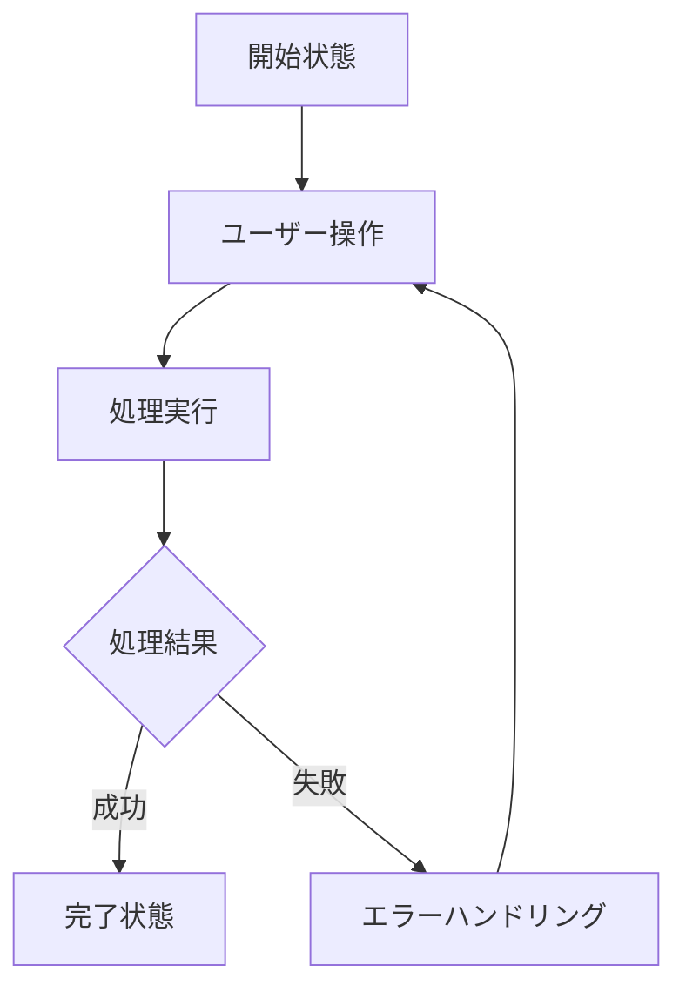

# [画面名] (画面名)

## 目的

[ユーザーが達成したいことを1文、20字以内で]

## 手順

1. [最初の操作]
2. [必要最小限の設定]
3. [確認方法]

## 例

[実際に試せる具体例]

---

## 実装詳細

### 主要コンポーネント

**状態管理**

- [使用するProvider名]で[管理する状態]を監視
- [特定条件時]に[実行される処理]

**UI構成**

- [主要なWidget構成]
- [特徴的なレイアウト手法]
- [ナビゲーション・インタラクション方式]

### 画面構成

**表示タイミング**: [画面が表示される条件]

**コンポーネント**: `[メインWidgetクラス名]`

**UI要素**:

1. **[要素名1]**
   - [具体的な仕様]
   - [サイズ・位置・スタイル]
   - [インタラクション動作]

2. **[要素名2]**
   - [具体的な仕様]
   - [条件による表示切り替え]

### データ取得・処理機能

**[主要機能名](`[メソッド名]`)**

- [データソース・処理内容]
- [エラーハンドリング方法]
- [状態管理詳細]

### 状態管理

**[状態管理手法] (例: Hooks使用状態)**

- [ローカル状態の管理項目]
- [状態更新トリガー]

**[外部状態連携] (例: Riverpod Provider連携)**

- [監視する状態]
- [リアルタイム更新仕様]

### フロー図

**[主要操作フロー]**



### エラーハンドリング

**表示パターン**

- 🔴 [クリティカルエラー]: [対処法]
- 🟡 [重要エラー]: [対処法]
- 🟢 [軽微な問題]: [対処法]

**エラー監視**: `[監視方法・実装場所]`

**エラー表示形式**:

- [表示方法（スナックバー・ダイアログなど）]
- [メッセージ内容・国際化キー]
- [ユーザーアクション]

### ユーザーインタラクション

**主要操作**

- [操作1]: [動作詳細]
- [操作2]: [動作詳細]
- [操作3]: [動作詳細]

**操作フィードバック**

- [ローディング表示]
- [成功時のフィードバック]
- [操作完了時の遷移]

### パフォーマンス最適化

**メモリ効率**

- [メモリ使用量削減手法]
- [インスタンス管理方法]

**UI応答性**

- [非同期処理中のユーザー体験]
- [アニメーション・遷移時間]

## 設定値・定数

**[カテゴリ名]設定**

**実装場所**: `[ファイルパス]:[行番号]`

```dart
// 主要な設定値
const [設定名] = [値];
const [設定名2] = [値2];
```

## ナビゲーション

**遷移条件**:

- [条件1] → [遷移先画面]
- [条件2] → [遷移先画面]
