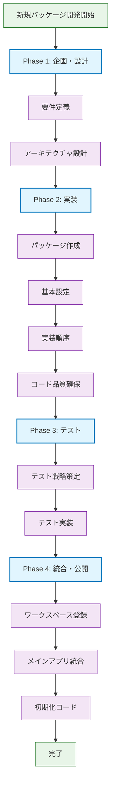
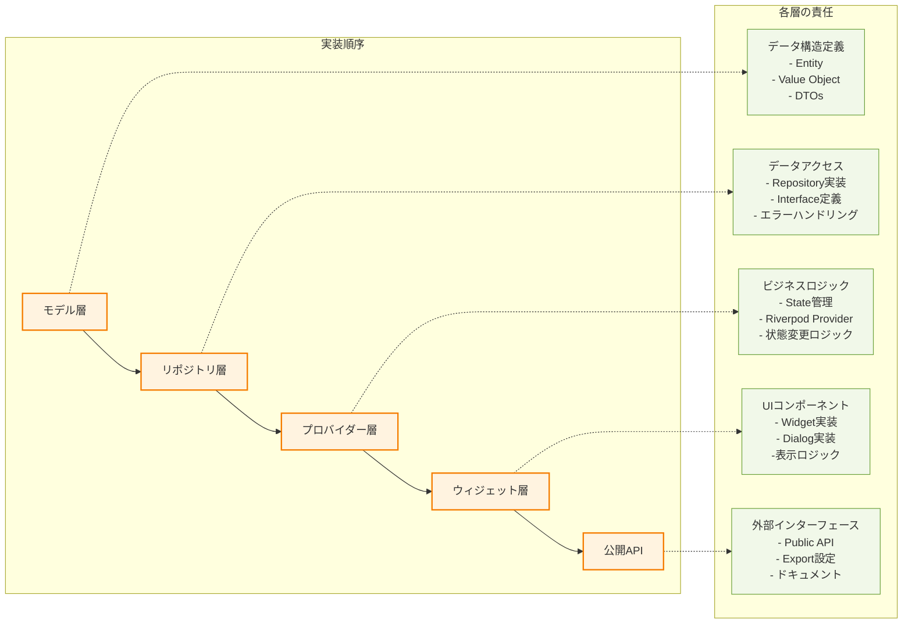
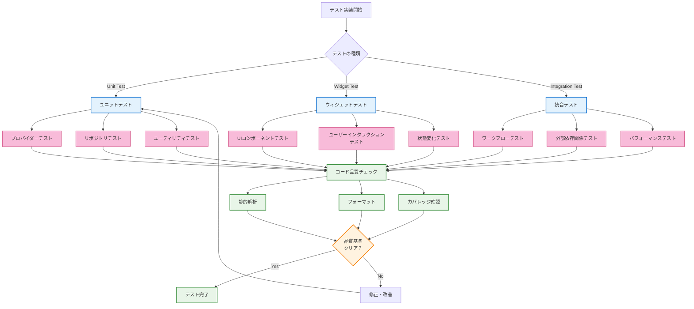
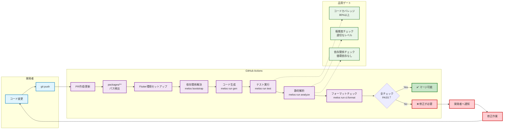

# パッケージ開発者ガイド

このドキュメントは、Flutter Template Projectのpackagesディレクトリで開発を行う人間の開発者向けの詳細なガイドです。

## 🎯 このドキュメントの目的

- パッケージ開発の標準化された手順の提供
- チーム間での一貫した開発プラクティスの確立
- 新メンバーの円滑なオンボーディング支援
- 保守性の高いコードベース構築の支援

## 📦 パッケージシステム概要

### 設計思想

このプロジェクトでは、機能をドメイン別に分離したマイクロパッケージアーキテクチャを採用しています。各パッケージは以下の原則に従います：

- **単一責任の原則**: 一つのパッケージは一つの明確な責任を持つ
- **疎結合**: パッケージ間の依存関係を最小限に抑制
- **高凝集**: 関連する機能を一つのパッケージに集約
- **再利用性**: 他のプロジェクトでも利用可能な設計
- **テスタビリティ**: 独立したユニットテストが可能

### 現在のパッケージ構成

#### app_preferences

**目的**: アプリケーション設定の管理  
**責任範囲**:

- ユーザーの言語設定（日本語/英語）
- テーマ設定（システム/ライト/ダーク）
- 設定値の永続化（SharedPreferences）
- 設定変更UI（ダイアログ、表示コンポーネント）

**技術スタック**:

- 状態管理: Riverpod + hooks_riverpod
- 永続化: SharedPreferences
- 国際化: slang（型安全な翻訳）
- UI: Material 3 Design System
- アーキテクチャ: Clean Architecture

## 🚀 開発環境のセットアップ

### 前提条件

以下のツールがインストールされていることを確認してください：

```bash
# Flutter SDK（fvmで管理）
fvm --version

# Melos（モノレポ管理）
melos --version

# Node.js（commitlint、prettier用）
node --version
npm --version
```

### 初回セットアップ

```bash
# 1. リポジトリのクローン
git clone [repository-url]
cd flutter_template_project

# 2. Flutter環境の設定
fvm use

# 3. 依存関係の解決
melos bootstrap

# 4. コード生成
melos run gen

# 5. テスト実行（環境確認）
melos run test
```

## 📋 新規パッケージ開発フロー

### 全体ワークフロー図



### パッケージ実装フロー図



### テスト戦略フロー図



### CI/CD統合フロー図



### パッケージアーキテクチャ構造図

```mermaid
flowchart TB
    subgraph "Package Architecture"
        subgraph "Public API Layer"
            API[package_name.dart<br/>公開インターフェース]
        end
        
        subgraph "Presentation Layer"
            W1[Widgets]
            W2[Dialogs]
            W3[UI Components]
        end
        
        subgraph "Business Logic Layer"
            P1[Providers<br/>@riverpod]
            P2[Notifiers]
            P3[State Management]
        end
        
        subgraph "Data Layer"
            R1[Repositories]
            R2[Interfaces]
            R3[Data Sources]
        end
        
        subgraph "Domain Layer"
            M1[Models]
            M2[Entities]
            M3[Value Objects]
        end
        
        subgraph "Infrastructure"
            U1[Utils]
            U2[Extensions]
            U3[Constants]
            E1[Exceptions]
        end
    end
    
    subgraph "External Dependencies"
        EXT1[SharedPreferences]
        EXT2[HTTP Client]
        EXT3[External APIs]
    end
    
    %% 依存関係
    API --> W1
    API --> P1
    W1 --> P1
    W2 --> P1
    W3 --> P1
    P1 --> R1
    P2 --> R1
    P3 --> R1
    R1 --> R2
    R1 --> M1
    R3 --> EXT1
    R3 --> EXT2
    R3 --> EXT3
    M1 --> M2
    M1 --> M3
    P1 --> U1
    R1 --> U2
    W1 --> U3
    P1 --> E1
    R1 --> E1
    
    %% スタイル定義
    classDef publicAPI fill:#e3f2fd,stroke:#1976d2,stroke-width:3px
    classDef presentation fill:#f3e5f5,stroke:#7b1fa2,stroke-width:2px
    classDef business fill:#e8f5e8,stroke:#388e3c,stroke-width:2px
    classDef data fill:#fff3e0,stroke:#f57c00,stroke-width:2px
    classDef domain fill:#fce4ec,stroke:#c2185b,stroke-width:2px
    classDef infrastructure fill:#f1f8e9,stroke:#689f38,stroke-width:2px
    classDef external fill:#efebe9,stroke:#5d4037,stroke-width:2px

    class API publicAPI
    class W1,W2,W3 presentation
    class P1,P2,P3 business
    class R1,R2,R3 data
    class M1,M2,M3 domain
    class U1,U2,U3,E1 infrastructure
    class EXT1,EXT2,EXT3 external
```

### Phase 1: 企画・設計

#### 1.1 要件定義

新しいパッケージを作成する前に、以下を明確にしてください：

````markdown
## パッケージ企画書テンプレート

### 基本情報

- パッケージ名: [snake_case]
- 目的: [一文で表現]
- 対象ドメイン: [例: 認証, 通知, データ同期]

### 機能要件

- [ ] 主要機能1
- [ ] 主要機能2
- [ ] 主要機能3

### 非機能要件

- [ ] パフォーマンス要件
- [ ] セキュリティ要件
- [ ] 可用性要件

### 技術仕様

- 状態管理: Riverpod
- 永続化: [SharedPreferences / SQLite / など]
- 外部API: [あれば記載]
- 特別な依存関係: [あれば記載]

### 公開API設計

```dart
// 想定される公開APIの設計例
class SomeFeature {
  Future<void> initialize();
  Future<Result> performAction();
}
```
````

#### 1.2 アーキテクチャ設計

パッケージの内部構造を設計します：

```bash
lib/
├── [package_name].dart # 公開API定義
├── src/
│ ├── providers/ # 状態管理
│ │ ├── [feature]_provider.dart
│ │ └── [feature]\_notifier.dart
│ ├── repositories/ # データアクセス層
│ │ ├── [feature]\_repository.dart
│ │ └── interfaces/
│ │ └── i_[feature]\_repository.dart
│ ├── models/ # データモデル
│ │ ├── [entity].dart
│ │ └── [value_object].dart
│ ├── widgets/ # UIコンポーネント
│ │ ├── [feature]\_widget.dart
│ │ └── dialogs/
│ ├── utils/ # ユーティリティ
│ │ ├── constants.dart
│ │ ├── extensions.dart
│ │ └── helpers.dart
│ └── exceptions/ # 例外定義
│ └── [feature]\_exceptions.dart
├── assets/ # 静的リソース
│ └── i18n/ # 翻訳ファイル
└── test/ # テスト
├── unit/
├── widget/
└── integration/

```

### Phase 2: 実装

#### 2.1 パッケージ作成

```bash
cd packages
flutter create --template=package your_package_name
cd your_package_name
```

#### 2.2 基本設定

```bash
# ワークスペース対応
echo "resolution: workspace" >> pubspec.yaml

# 依存関係追加
flutter pub add hooks_riverpod riverpod_annotation
flutter pub add --dev build_runner riverpod_generator yumemi_lints

# 静的解析設定
FLUTTER_VERSION=$(flutter --version | head -n 1 | grep -o "[0-9]\+\.[0-9]\+\.[0-9]\+")
cat > analysis_options.yaml << EOF
include: package:yumemi_lints/flutter/${FLUTTER_VERSION}/recommended.yaml

analyzer:
  errors:
    invalid_annotation_target: ignore
  plugins:
    - custom_lint

formatter:
  trailing_commas: preserve
EOF
```

#### 2.3 実装順序

**推奨実装順序:**

1. **モデル層**: データ構造の定義
2. **リポジトリ層**: データアクセスロジック
3. **プロバイダー層**: ビジネスロジック・状態管理
4. **ウィジェット層**: UIコンポーネント
5. **公開API**: パッケージの外部インターフェース

#### 2.4 コード品質の確保

各実装段階で以下を実行：

```bash
# コード生成
dart run build_runner build --delete-conflicting-outputs

# 静的解析
dart analyze

# フォーマット
dart format .

# テスト実行
flutter test
```

### Phase 3: テスト

#### 3.1 テスト戦略

```markdown
## テスト分類と責任範囲

### ユニットテスト (test/unit/)

- プロバイダーのロジック
- リポジトリの動作
- ユーティリティ関数
- バリデーション

### ウィジェットテスト (test/widget/)

- UIコンポーネントの表示
- ユーザーインタラクション
- 状態変化の反映

### 統合テスト (test/integration/)

- パッケージ全体のワークフロー
- 外部依存関係との連携
```

#### 3.2 テスト実装例

```dart
// test/unit/providers/example_provider_test.dart
import 'package:flutter_test/flutter_test.dart';
import 'package:hooks_riverpod/hooks_riverpod.dart';

void main() {
  group('ExampleProvider', () {
    test('初期状態が正しく設定される', () {
      final container = ProviderContainer();
      final provider = container.read(exampleProvider);

      expect(provider.value, equals(expectedInitialValue));
    });

    test('状態更新が正しく動作する', () async {
      final container = ProviderContainer();
      final notifier = container.read(exampleProvider.notifier);

      await notifier.updateState(newValue);

      expect(container.read(exampleProvider).value, equals(newValue));
    });
  });
}
```

### Phase 4: 統合・公開

#### 4.1 ワークスペース登録

```yaml
# ルートのpubspec.yamlに追加
workspace:
  - apps
  - packages/app_preferences
  - packages/your_package_name # 新規追加
```

#### 4.2 メインアプリ統合

```yaml
# apps/pubspec.yamlに依存関係追加
dependencies:
  your_package_name:
    path: ../packages/your_package_name
```

#### 4.3 初期化コード

```dart
// apps/lib/main.dart
void main() async {
  WidgetsFlutterBinding.ensureInitialized();

  // パッケージ初期化
  await YourPackageInitializer.initialize();

  runApp(
    ProviderScope(
      overrides: [
        // 必要に応じて依存性注入
      ],
      child: App(),
    ),
  );
}
```

## 🛠 開発時の留意事項

### コーディング規約

#### Dartコーディングスタイル

```dart
// ✅ 良い例: 明確な命名
class UserAuthenticationRepository {
  Future<AuthResult> authenticateUser(Credentials credentials) async {
    // 実装
  }
}

// ❌ 悪い例: 曖昧な命名
class AuthRepo {
  Future<dynamic> auth(dynamic creds) async {
    // 実装
  }
}
```

#### ドキュメント記述

````dart
/// ユーザー認証を管理するリポジトリ
///
/// このクラスは以下の責任を持ちます：
/// - 認証情報の検証
/// - セッション管理
/// - トークンの更新
///
/// 使用例:
/// ```dart
/// final repo = UserAuthenticationRepository();
/// final result = await repo.authenticateUser(credentials);
/// ```
class UserAuthenticationRepository {
  // 実装
}
````

### エラーハンドリング

```dart
// カスタム例外の定義
class AuthenticationException implements Exception {
  const AuthenticationException(this.message, [this.code]);

  final String message;
  final String? code;

  @override
  String toString() => 'AuthenticationException: $message';
}

// リポジトリでのエラーハンドリング
class UserAuthenticationRepository {
  Future<AuthResult> authenticateUser(Credentials credentials) async {
    try {
      // 認証処理
      return AuthResult.success(user);
    } on NetworkException catch (e) {
      throw AuthenticationException('ネットワークエラーが発生しました', 'NETWORK_ERROR');
    } catch (e) {
      throw AuthenticationException('予期しないエラーが発生しました', 'UNKNOWN_ERROR');
    }
  }
}
```

### パフォーマンス考慮事項

```dart
// ✅ 良い例: 適切なプロバイダーの使い分け
@riverpod
class ExpensiveDataNotifier extends _$ExpensiveDataNotifier {
  @override
  Future<ExpensiveData> build() async {
    // 重い処理は必要時のみ実行
    return await loadExpensiveData();
  }
}

// ✅ 良い例: キャッシュの活用
@Riverpod(keepAlive: true)
Future<ConfigData> configData(ConfigDataRef ref) async {
  // 設定データは一度読み込んだらキャッシュ
  return await loadConfigData();
}
```

## 🔄 継続的インテグレーション

### GitHub Actions連携

パッケージ変更時の自動チェック：

```yaml
# .github/workflows/packages-check.yml
name: Packages Check
on:
  pull_request:
    paths:
      - 'packages/**'

jobs:
  package-quality:
    runs-on: ubuntu-latest
    steps:
      - uses: actions/checkout@v4

      - name: Setup Flutter
        uses: ./.github/actions/setup-flutter

      - name: Generate code
        run: melos run gen

      - name: Run tests
        run: melos run test

      - name: Static analysis
        run: melos run analyze

      - name: Check formatting
        run: melos run ci:format
```

### コードレビューチェックリスト

#### 機能面

- [ ] 要件を満たしているか
- [ ] エッジケースが考慮されているか
- [ ] エラーハンドリングが適切か
- [ ] パフォーマンスに問題がないか

#### 設計面

- [ ] 単一責任原則に従っているか
- [ ] 適切な抽象化レベルか
- [ ] 依存関係が最小限か
- [ ] 拡張性が考慮されているか

#### コード品質

- [ ] 命名が明確で一貫しているか
- [ ] コメント・ドキュメントが適切か
- [ ] テストカバレッジが十分か
- [ ] 静的解析をパスしているか

## 📊 メトリクス・モニタリング

### 品質メトリクス

```bash
# テストカバレッジの確認
flutter test --coverage
genhtml coverage/lcov.info -o coverage/html

# 複雑度分析
dart run dart_code_metrics:metrics analyze lib

# 依存関係の可視化
melos deps graph
```

### パフォーマンス測定

```dart
// パフォーマンス計測の例
class PerformanceLogger {
  static Future<T> measure<T>(
    String operation,
    Future<T> Function() action,
  ) async {
    final stopwatch = Stopwatch()..start();
    try {
      final result = await action();
      stopwatch.stop();
      print('$operation: ${stopwatch.elapsedMilliseconds}ms');
      return result;
    } catch (e) {
      stopwatch.stop();
      print('$operation failed after ${stopwatch.elapsedMilliseconds}ms: $e');
      rethrow;
    }
  }
}
```

## 🚨 トラブルシューティング

### よくある問題と解決方法

#### 1. コード生成が失敗する

```bash
# キャッシュクリア
flutter clean
dart run build_runner clean

# 再生成
dart run build_runner build --delete-conflicting-outputs
```

#### 2. 依存関係の競合

```bash
# 依存関係の確認
flutter pub deps

# workspace resolutionの確認
melos list --graph
```

#### 3. テストが不安定

```bash
# テストの並列実行を無効化
flutter test --concurrency=1

# 特定のテストのみ実行
flutter test test/specific_test.dart
```

## 📚 参考資料

### 公式ドキュメント

- [Flutter Package Development](https://docs.flutter.dev/development/packages-and-plugins/developing-packages)
- [Riverpod Documentation](https://riverpod.dev/)
- [Melos Documentation](https://melos.invertase.dev/)

### 内部ドキュメント

- [プロジェクト全体のCLAUDE.md](../CLAUDE.md)
- [アプリケーション開発ガイド](../apps/README.md)
- [コミット規約](../docs/commitlint-setup.md)

### 推奨書籍・記事

- Clean Architecture (Robert C. Martin)
- Flutter in Action (Eric Windmill)
- Effective Dart (dart.dev)

## 💬 質問・サポート

### 社内サポート

- **技術質問**: #flutter-help Slackチャンネル
- **アーキテクチャ相談**: アーキテクトチームまで
- **緊急時対応**: オンコールエンジニアまで

### 外部リソース

- Flutter コミュニティ: [Discord](https://discord.gg/flutter)
- Stack Overflow: `flutter` タグ
- GitHub Issues: 各パッケージのリポジトリ

---

このガイドが皆さんの開発を支援し、高品質なパッケージシステムの構築に貢献することを願っています。質問や改善提案があれば、いつでもお気軽にお声がけください。
